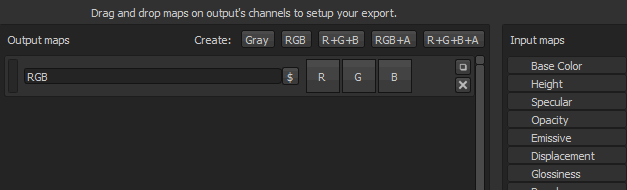

# Criar Modelos de saída

Esta página explica como criar e modificar Modelos de saída personalizados. Modelos de saída controlam o nome e a configuração das texturas exportadas. A criação de um Modelo de saída personalizado permite configurar as exportações para que correspondam perfeitamente ao fluxo de trabalho.

A guia de configuração da janela de exportação é dividida em três partes principais:

* <b>Lista de predefinições:</b> (à esquerda) permite escolher qual modelo editar ou duplicar e renomear modelos existentes.
* <b>Lista de texturas de saída</b>: (no meio) lista o conteúdo de uma predefinição selecionada e exibe a convenção de nomenclatura e as opções de embalagem de canal.
* <b>Lista de Canais</b> e <b>Texturas convertidas</b>: lista (à direita) de canais e texturas a serem usados para compor o conteúdo de uma textura exportada.

{width="800px"}

>[!NOTE]
>
> Os modelos de saída são salvos no disco como <b>arquivos individuais</b> e podem ser compartilhados com qualquer outro usuário do Substance 3D Painter.\
> Você pode encontrar os arquivos locais dos modelos personalizados que criou na pasta assets/export-presets dos seus [arquivos do Substance 3D Painter](../pipeline-and-integration/resource-management/shelf-and-assets-location.md).

>[!NOTE]
>
> Quando um modelo é usado para exportar texturas, o arquivo de modelo é incluído automaticamente no arquivo de projeto nos salvamentos subsequentes.\
> Isso permite compartilhar e/ou mover um projeto para outro computador, mantendo os modelos para exportar as texturas.\
> Somente a última predefinição usada é salva no projeto. No entanto, se o Substance 3D Painter detectar uma predefinição com o mesmo nome, a predefinição dentro do projeto será marcada como “Desatualizada” na lista.

## Criação de um modelo

Na parte superior da lista de predefinições, há três botões:

* <b> Duplicado</b> : duplicar um modelo existente.
* <b> Remover</b>: exclua qualquer modelo selecionado.
* <b> Criar</b>: crie um modelo novo e vazio.

Você também pode clicar duas vezes em um modelo ou <b>clicar com o botão direito do mouse > renomear</b> para alterar o nome de um modelo.

## Criação de mapas de saída

Depois que um modelo é selecionado, é possível adicionar novos mapas de saída usando os botões dedicados, que estão disponíveis na parte superior da seção do meio da janela.

Depois que um mapa é criado, é possível nomeá-lo e, em seguida, arrastar e soltar mapas de entrada em um dos slots de canal disponíveis.\
Depois que um mapa de entrada for solto na seção de mapas de saída, um menu será aberto perguntando que tipo de conteúdo deve ser carregado nesse slot.

As opções variam de canais <b>RGB</b> e <b>individuais</b> até a conversão <b>Alpha</b> e <b>Tons de Cinza</b> da entrada.

>[!NOTE]
>
> Sempre que um mapa de entrada é arrastado e solto, uma cor aleatória é gerada. Isso fornece uma indicação visual para os canais e o mapa de entrada correspondente carregado.\
> O botão também indica o que está carregado no slot:
> 
> * Cor do plano de fundo: indica quais mapas de <b>entrada</b> foram carregados.
> * barra de RGB: indique se os canais <b>R</b>, <b>G</b> e <b>B</b> do mapa de entrada estão carregados.
> * Barra vermelha: indique se o canal <b>vermelho</b> do mapa de entrada está carregado.
> * Barra verde : indica que o canal <b>verde</b> do mapa de entrada está carregado.
> * Barra azul: indique que o canal <b>azul</b> do mapa de entrada está carregado.
> * Barra cinza: indique se o mapa de entrada está carregado como uma <b>escala de cinza</b> (de uma conversão de RGB para escala de cinza ou porque a entrada já está em escala de cinza).
> * Linha em preto/branco: indica que o canal <b>alfa</b> do mapa de entrada está carregado. No Substance 3D Painter, o alfa de uma entrada corresponde à área total pintada.

## Nomear mapas de saída

Alguns sinalizadores estão disponíveis para gerar automaticamente o nome da textura durante o processo de exportação.

* <b> $mesh</b> : nome do arquivo de malha carregado no projeto
* <b> $textureSet</b> : nome do conjunto de textura
* <b> /</b> (barra): separação de pastas

<b> Exemplo</b> : cymourai.fbx com um conjunto de textura chamado “MaterialBase”

* <b>$mesh\_$textureSet\_BaseColor</b> gerará <b>cymourai\_MaterialBase\_BaseColor.png.</b>
* <b>$mesh/$textureSet\_BaseColor</b> gerará uma pasta chamada <b>cymourai</b> com uma textura chamada <b>MaterialBase\_BaseColor.png</b> dentro dela.

>[!NOTE]
>
> As pastas são convertidas automaticamente como grupos caso o formato de exportação seja definido como formato de arquivo **PSD** (Photoshop).

## Atribuição de canais a mapas de saída

É possível deixar alguns canais (do mapa de saída) totalmente vazios. Nesse caso, uma cor padrão será atribuída.

>[!NOTE]
>
> Se um slot se referir a um canal que não está presente no conjunto de Textura durante a exportação, uma cor padrão também será gerada.\
> Essa cor muda dependendo do canal, o que indica o melhor valor neutro.\
>  **Exemplo**: se ausente, o canal de height será gerado com um valor de cinza padrão.

Existem diferentes tipos de mapas:

* <b>Mapas de entrada</b>: canais diretos que podem ser adicionados em um conjunto de texturas. Por meio do painel de configurações do TextureSet.
* <b> Mapas de malha</b>: texturas presentes nos slots de mapa adicionais de um Conjunto de texturas (texturas assadas).
* <b> Mapas convertidos:</b> texturas virtuais, elas são geradas durante a exportação com base nos canais presentes no documento.
  * <b>Normal OpenGL/DirectX</b> : gera um normal no espaço dedicado combinando o normal dos mapas adicionais, o height e o canal normal.
  * <b>AO</b> misto: combine o mapa adicional de Oclusão ambiente com o canal de Oclusão ambiente.
  * <b>Difusa</b>: cor difusa gerada a partir da BaseColor e de canais Metálicos (as partes metálicas serão substituídas por uma cor preta).
  * <b>Specular</b>: cor do Specular gerada a partir de BaseColor e canais metálicos.
  * <b>Textura reluzente</b>: inverso do canal de aspereza.
  * <b>Difusão do Unity4</b>: cor difusa gerada a partir do BaseColor para corresponder aos sombreadores do Unity4.
  * <b>Brilho Unity4</b>: a textura reluzente gerada a partir do canal Aspereza e Metálico para corresponder aos sombreadores Unity4.
  * <b>Reflexo</b>: exporte um mapa no qual o branco indique materiais dielétricos e outras cores para materiais metálicos
  * <b>1/ior</b>: 1 dividido pelo valor ior, ior é gerado a partir do mapa metálico: 1,4 para dielétricos, 100 para metais (cor preta)
  * <b>Textura reluzente2</b>: versão quadrada do canal de textura reluzente (Textura reluzente \*)
  * <b>f0</b>: valor de refletância em fresnel 0 (0,04 para dielétricos, 1,0 para metálicos)
