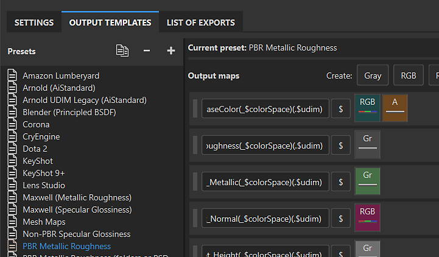

# Modelos de saída

O Substance 3D Painter tem dois tipos de Modelo de saída que podem ser usados para controlar o comportamento do processo de exportação.

* Os [Modelos de saída padrão](default-presets.md) foram desenvolvidos para funcionar com fluxos de trabalho ou aplicativos 3D específicos e estão disponíveis na <b>guia Modelos de saída</b> da <b>janela de exportação</b>. É possível duplicar e modificar um modelo padrão ou criar seu próprio modelo do zero.
* [Modelos de saída predefinidos](../../export/export-presets/predefined-presets/predefined-presets.md) não podem ser modificados. Os modelos predefinidos aparecem na parte superior da <b>lista suspensa de Modelos de saída</b> na <b>guia Configurações</b> da <b>janela de exportação</b>.
