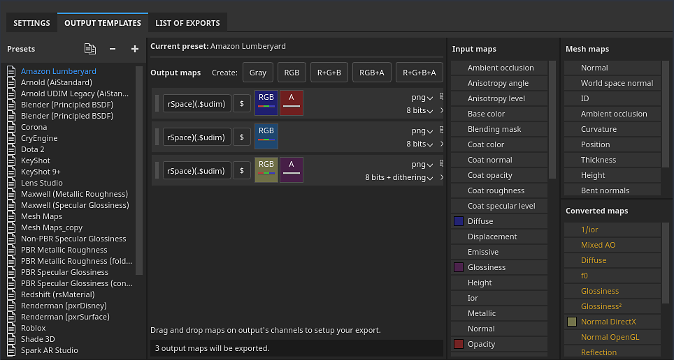
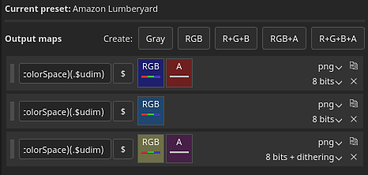
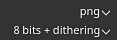

# Modelos de saída

{width="500px"}

A guia Modelo de saída permite gerenciar e criar novos Modelos de saída. Você pode usar Modelos de saída para modificar os nomes, os formatos e a configuração das texturas exportadas.

## Lista de predefinições

A lista Predefinições mostra todos os Modelos de saída disponíveis. Esta lista inclui uma coleção de [Modelos de saída padrão](../export-presets/default-presets.md), bem como todos os modelos personalizados que você criou.

Nesta lista, os modelos podem ser <b>criados</b>, <b>renomeados</b>, <b>duplicados</b> ou <b>excluídos</b>.

| Ação | Visual | Descrição |
| --- | --- | --- |
| **Duplicar** | 

 | Cria uma cópia do modelo de saída atualmente selecionado na lista. |
| **Remover** | 

 | Remove o modelo de saída selecionado atualmente na lista.  **Observação:** a exclusão de um modelo não pode ser desfeita. |
| **Adicionar** | 

 | Adicione um novo modelo de saída vazio. |
| **Clique duas vezes** | 

 | Renomeie o modelo de saída selecionado. |
| **Clique com o botão direito do mouse** | 

 | Clique com o botão direito do mouse em um modelo para abrir o menu contextual, onde você pode excluir, renomear ou duplicar um modelo. |

## Lista de mapas de saída

Esta seção lista todas as texturas que serão geradas pelo modelo e suas composições.

### Mapear tipos e palavras-chave

A linha superior lista todos os tipos de textura que podem ser criados:

| Botão | Visual | Descrição |
| --- | --- | --- |
| **Cinza** | 

 | Adicione um novo mapa em tons de cinza. |
| **RGB** | 

 | Adicione um novo mapa de cores RGB. |
| **R+G+B** | 

 | Adicione um novo mapa de RGB com 3 slots individuais em tons de cinza. |
| **RGB+A** | 

 | Adicione um novo mapa de RGB e um slot alfa (em tons de cinza). |
| **R+G+B+A** | 

 | Adicione um novo mapa RGBA com 4 slots individuais em tons de cinza. |

>[!NOTE]
>
> Alguns tipos podem ser mesclados/recolhidos quando estiverem vazios ou compartilharem o mesmo mapa de entrada:
> 
> 

### Nome do mapa

Cada textura pode ser nomeada usando uma convenção de nomenclatura personalizada. Algumas palavras-chave podem ser adicionadas (com a ajuda do botão **$**) para serem substituídas automaticamente pelo aplicativo quando o arquivo final for gerado:

| Palavra-chave | Descrição |
| --- | --- |
| **$projeto** | Substituído pelo nome do arquivo de projeto (.spp). |
| **$mesh** | Substituído pelo nome do arquivo de malha (arquivo de malha de entrada, como .fbx) |
| **$textureset** | Substituído pelo nome do material/conjunto de texturas do qual a textura é gerada. |
| **$udim** | Substituído pelo número UDIM do qual uma textura é gerada. |
| **$colorSpace** | Substituído pelo nome do espaço de cores usado para o canal indicado (RGB ou G, ignora Alpha). |

### Mapear formato e profundidade de bits de arquivo

A primeira lista suspensa pode ser usada para especificar o formato de arquivo do mapa de saída atual.

A segunda lista suspensa é usada para especificar a profundidade de bits do mapa de saída. A profundidade de bits depende do formato de arquivo selecionado. Consulte [Configurações de exportação](export-settings.md) para obter mais detalhes.

>[!NOTE]
>
> Para que as configurações de formato e profundidade de bits sejam consideradas na exportação, verifique se o tipo de arquivo nas configurações gerais está definido como **Baseado no modelo de saída**.

## Lista do mapa de origem

### Mapas de entrada

A lista de mapas de entrada agrupa todos os canais que podem ser adicionados por meio das [configurações do Conjunto de Texturas](../../interface/texture-set/texture-set-settings.md).

>[!NOTE]
>
> Os canais do **usuário** são baseados no nome original (**usuário\_x**), nomes personalizados são ignorados.

### Mapas de malha

Os mapas de malha são as texturas assadas:

| Nome | Descrição |
| --- | --- |
| **Normal** | Mapa normal assado. |
| **Espaço mundial normal** | Espaço do mundo assado normal. |
| **ID** | ID assada. |
| **oclusão de ambiente** | Oclusão ambiente assada |
| **Curvatura** | Curvatura assada. |
| **Posição** | Posição assada. |
| **Thickness** | Thickness assado. |
| **Height** | Height assado. |
| **Normais tortos** | Cozido normal curvado. |

### Mapas convertidos

Mapas convertidos são mapas gerados pelo aplicativo de outra origem:

| Nome | Descrição |
| --- | --- |
| **OpenGL normal** | Mapa normal combinado no formato OpenGL do normal assado e canal normal do conjunto de textura. |
| **DirectX normal** | O mapa normal combinado no formato de DirectX do normal assado e o canal normal do conjunto de texturas. |
| **AO misto** | Oclusão ambiente combinada da oclusão ambiente assada e do canal de oclusão ambiente do conjunto de texturas. |
| **Difusa** | Textura difusa gerada a partir da **Cor base** e do canal **Metálico** (as áreas metálicas são substituídas por uma cor preta). |
| **Specular** | Textura de specular gerada do canal **Cor Base** e **Metálico**. |
| **Textura reluzente** | Textura de textura reluzente gerada do inverso do canal de aspereza. |
| **Difusão do Unity4** | Descontinuado. Textura difusa gerada do canal **Cor base** para corresponder aos sombreadores da Unidade 4. |
| **Brilho da Unidade4** | Descontinuado. Textura reluzente gerada a partir do canal **Aspereza** e **Metálico** para corresponder aos sombreadores do Unity 4. |
| **Reflexo** | Texturas em que o branco indica um material dielétrico e outras cores como materiais metálicos. |
| **1/i** | Textura contendo 1 dividido pelo valor **IOR**. **IOR** é gerado a partir do mapa metálico: 1.4 para dielétricos, 100 para metais (cor preta). |
| **Textura reluzente2** | Versão quadrada do canal **Textura reluzente** (**Textura reluzente** \* **Textura reluzente**) |
| **f0** | Textura que contém o valor de refletância como afrescos 0 (0,04 para dieletrics, 1,0 para metálicos). |
