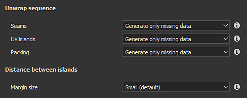

# Desempacotamento automático de UV

\
O desencapsulamento automático UV permite gerar Ilhas UV automaticamente ao importar um modelo 3D. Pode ser usado para pintar em modelos 3D que não tenham UVs existentes.

## Habilitando o desencapsulamento UV automático

Ao criar um novo projeto ou reimportar uma malha para um projeto existente, certifique-se de que a configuração “Desfazer quebra automática” esteja marcada. Se desativado, o processo será ignorado e os UVs de malha permanecerão como estão.

## Configurações de desencapsulamento UV

Ao importar uma malha e usar o processo de abertura, as seguintes configurações estão disponíveis. Algumas configurações estão disponíveis por meio do botão Opções na interface.

| Seção | ***Configuração*** | ***Descrição*** |
| --- | --- | --- |
| **Desempacotar sequência** | **Faixas** | Controla se as emendas (bordas de Ilha UV) devem ser geradas apenas para malhas que não as tenham ou sempre regeneradas.Valores possíveis:<ul data-preserve-html="true"><li data-preserve-html="true"><strong> Gerar dados ausentes </strong> (padrão): as emendas serão geradas para malhas ausentes.</li><li data-preserve-html="true"><strong> Recalcular todos os </strong>: As emendas serão geradas para todas as malhas.</li></ul> |
| **Ilhas UV** | Controla se a abertura UV deve ser gerada de malhas sem UVs ou para quaisquer malhas. Valores possíveis:<ul data-preserve-html="true"><li data-preserve-html="true"><strong> Gerar dados ausentes </strong> (padrão): o desencapsulamento de UV será gerado para UVs ausentes de malhas.</li><li data-preserve-html="true"><strong> Recalcular todos os </strong>: o desencapsulamento UV será gerado para todas as malhas.</li></ul> |  |
| **Embalagem** | Controla a embalagem/layout das Ilhas UV das malhas.Valores possíveis:<ul data-preserve-html="true"><li data-preserve-html="true"><strong> Gerar dados ausentes </strong> (padrão): empacotar Ilhas UV para malhas sem UVs.</li><li data-preserve-html="true"><strong> Recalcular todos os </strong>: empacotar todas as Ilhas UV.</li></ul> |  |
|  |  |  |
| **Personalização de layout** | **Tamanho da margem** | Define o espaçamento entre as Ilhas UV. Essa configuração aplica uma porcentagem geral independente da resolução.Valores possíveis:<ul data-preserve-html="true"><li data-preserve-html="true"><strong> Nenhuma margem </strong> : 0%</li><li data-preserve-html="true"><strong> Pequeno </strong> (padrão): 0,2%</li><li data-preserve-html="true"><strong> Médio </strong> : 0,5%</li><li data-preserve-html="true"><strong> Grande </strong> : 1%</li></ul> |
|  | **Orientação da Ilha UV** | Controle a orientação das Ilhas UV durante o processo de embalagem.Valores possíveis:<ul data-preserve-html="true"><li data-preserve-html="true"><strong>Sem restrições</strong> (padrão): nenhuma restrição é aplicada para calcular a orientação.</li><li data-preserve-html="true"><strong>Alinhar com malha 3D</strong>: restringir a Ilha UV a ser orientada em direção à direção da malha</li></ul> |
|  |  |  |
| **Blocos UV** | **Número máximo de Blocos UV** | Se o fluxo de trabalho Blocos UV estiver ativado, essas configurações determinarão o número máximo de blocos a serem produzidos para distribuição nas Ilhas UV. |
|  |  |  |
| **Otimização** | **Evite Ilhas UV alongadas** | Se habilitado, este processo dividirá as Ilhas UV consideradas muito longas para melhorar o uso do espaço de textura.Exemplo de antes (superior) e depois (inferior): 

 |

## Limitações conhecidas

Veja abaixo uma lista de limitações relacionadas ao processo de desencapsulamento:

* O processamento de malhas de alta poli pode demorar muito tempo.
* Vértices nas mesmas coordenadas exatas são mesclados
* A geração de UV pode falhar em algumas partes da malha em alguns casos raros
* Relação de texel não uniforme ou altamente distorcida em uma única Ilha UV em alguns casos
* Proporção de texel não uniforme entre Conjuntos de textura
* A Ilha UV gerada pode ser muito alongada e, em alguns casos, não cabe no espaço UV
* Faces degeneradas ou faces de malha não triangulares com bordas pequenas ou sobrepostas podem não receber UV
