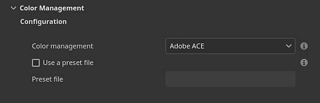

# Gerenciamento de cores com Adobe ACE - ICC

Esta página lista as configurações de gerenciamento de cores relacionadas ao Adobe Color Engine (ACE) para usar a imagem com perfis ICC.

## Configurações do projeto



As configurações de projeto podem ser definidas ao criar um novo projeto por meio da janela [novo projeto](../../getting-started/project-creation.md) ou usando a janela [configuração de projeto](../../interface/project-configuration.md).

>[!NOTE]
>
> Se uma variável de ambiente (veja abaixo) ou um arquivo de predefinição for carregado, as configurações na interface do usuário serão desativadas.

As configurações disponíveis são:

| Seção | Configuração | Descrição |
| --- | --- | --- |
| **Configuração** | **Gerenciamento de cores** | Defina qual mecanismo usar para gerenciar cores.Valores possíveis:<ul data-preserve-html="true"> <li data-preserve-html="true"><strong>Legado</strong> (padrão): use a correção de cores gama sRGB/sRGB linear predefinida.</li> <li data-preserve-html="true"><strong>OpenColorIO</strong>: use a integração OCIO.</li> <li data-preserve-html="true"><strong>Adobe ACE</strong>: Adobe Color Engine, para suportar perfis ICC.</li> </ul> |
|  | **Usar um arquivo de predefinição** | Se ativada, permita que o tod oriente as configurações de gerenciamento de cores por meio de um arquivo de configuração json. |
|  | **Arquivo predefinido** | Caminho para o arquivo de predefinição, em formato json. Para obter mais detalhes, consulte abaixo. |
|  |  |  |
| **Configurações de cores** | **Espaço de cores de trabalho** | O espaço de cores usado pelo mecanismo para trabalhar dentro do aplicativo. Corresponde ao espaço de cores a partir do qual as texturas podem ser convertidas em (importação) ou de (exportação). Os valores possíveis são:<ul data-preserve-html="true"> <li data-preserve-html="true"><strong>Linear sRGB IEC61966-2.1</strong> (padrão)</li> <li data-preserve-html="true"><strong>Espaço de trabalho ACES ACES AMPAS S-2014-004</strong> do ACEScg</li> <li data-preserve-html="true"><strong>Adobe RGB linear (1998)</strong></li> </ul> |
|  | **Método de renderização** | Especifique o método usado para converter cores entre espaços de cores.Valores possíveis:<ul data-preserve-html="true"> <li data-preserve-html="true"><strong>Perceptual</strong></li> <li data-preserve-html="true"><strong>Saturação</strong> (padrão)</li> <li data-preserve-html="true"><strong>Cromático relativo</strong></li> <li data-preserve-html="true"><strong>Cromático absoluto</strong></li> </ul> |
|  |  |  |
| **Padrões de espaço de cores de importação de bitmap** | **Imagens de 8 bits** | Espaço de cores a ser usado por padrão ao importar arquivos de imagem de 8 bits. |
|  | **Imagens de 16 bits** | Espaço de cores a ser usado por padrão ao importar arquivos de imagem de 16 bits. |
|  | **Imagens de ponto flutuante** | Espaço de cores a ser usado por padrão ao importar arquivos de imagem HDR/EXR. |
|  | **Usar perfis ICC incorporados quando disponíveis (recomendado)** | Se esta opção estiver ativada, use os perfis ICC, uma vez que o arquivo de imagem, para ajustar as cores. |
|  |  |  |
| **material de Substance** | **Padrão de espaço de cores de material** | Defina qual espaço de cores usar para entrada/saída gerenciada por cores de materiais de Substance. |
|  |  |  |
| **Exportar espaço de cores** | **Imagens de 8 bits** | Espaço de cores a ser usado por padrão ao exportar arquivos de imagem de 8 bits. |
|  | **Imagens de 16 bits** | Espaço de cores a ser usado por padrão ao exportar arquivos de imagem de 16 bits. |
|  | **Imagens de ponto flutuante** | Espaço de cores a ser usado por padrão ao exportar arquivos de imagem HDR/EXR. |

## Usar um arquivo de predefinição


É possível usar um arquivo de predefinição (no formato json) para orientar as configurações de ACE ao criar novos projetos.

### Variável de ambiente

A variável de ambiente **PAINTER\_ACE\_CONFIG** pode ser usada para especificar o caminho de um arquivo de predefinição. Se presente, o aplicativo sempre usará um arquivo de predefinição para orientar as configurações de Gerenciamento de cores. As configurações serão desativadas na interface.

Para obter mais detalhes, consulte a página [Variáveis de ambiente](../../pipeline-and-integration/configuration/environment-variables.md).

### Exemplo de predefinição

Veja abaixo um exemplo de um arquivo json que pode ser usado como um arquivo de predefinição:

```
{ 

  "color settings": { 

    "working color space": "Linear Adobe RGB (1998)", 

    "rendering intent": "Saturation" 

  }, 

  "bitmap import color space defaults" : { 

    "8 bit images": "image P3", 

    "16 bit images": "image P3", 

    "floating point images": "Raw", 

    "use embedded ICC profiles when available": false 

  }, 

  "substance material": { 

    "material color space default": "image P3" 

  }, 

  "export colors spaces" : { 

    "8 bit images": "image P3", 

    "16 bit images": "image P3", 

    "floating point images": "Raw" 

  } 

} 
```
