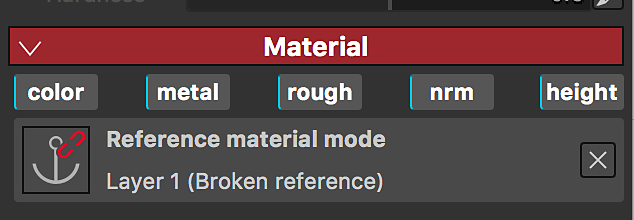

# Ponto de ancoragem

Um ponto de ancoragem é uma maneira de expor qualquer recurso ou elemento na pilha de camadas e referenciá-lo em diferentes áreas da pilha de camadas para diferentes fins e com um conjunto diferente de ajustes. Elas abrem um conjunto totalmente novo de possibilidades, permitindo que você vincule efetivamente camadas ou máscaras e tenha um único ponto de ancoragem que afete vários aspectos do seu projeto, transformando o Substance 3D Painter em uma experiência verdadeiramente não linear.

>[!NOTE]
>
> Um ponto de ancoragem só pode ser referenciado dentro da mesma textura criada. Não é possível criar vínculos entre uma âncora e suas referências em Conjuntos de texturas.

## Adicionar um ponto de ancoragem

Os Pontos de ancoragem estão disponíveis no menu Efeitos. Eles podem ser adicionados em camadas e máscaras.

## Usar um ponto de ancoragem como referência

Um ponto de ancoragem pode ser referenciado por outra camada: isso instanciará o conteúdo do ponto de ancoragem na camada que o referencia.

Os pontos de ancoragem podem ser usados como referência nos seguintes recursos:

* Camada de preenchimento
* Efeito de preenchimento
* Entrada de um filtro de substância (Efeito, Procedimento, Gerador)

Somente Pontos de ancoragem **abaixo** da camada que faz referência a ela podem ser usados como referências.\
Se você mover um ponto de ancoragem acima de uma camada referenciando-o, ele quebrará a referência. Você pode desfazer se quiser cancelar essa ação.

## Localizar referências de um ponto de ancoragem

Quando você clica em um ponto de ancoragem, pode ver nas propriedades a lista de camadas em que esse ponto de ancoragem é usado como referência.

## Localizar um ponto de ancoragem

Quando você é um efeito/camada de preenchimento usando um ponto de ancoragem como referência, pode pular para o ponto de ancoragem.

