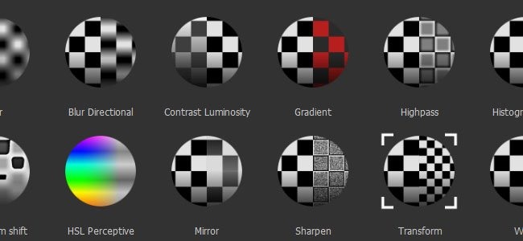

# Efeitos

{width="450px"}

Os Efeitos são um conjunto de várias **ações** que podem ser aplicadas ao **conteúdo** ou à **máscara** de uma **camada** na pilha de camadas do Substance 3D Painter.\
Eles permitem uma série infinita de alterações, desde simples variações de cores até criações de máscaras complexas. Vários efeitos são enviados com o Substance 3D Painter por padrão, mas você também pode criar seus próprios efeitos no Substance 3D Designer.

Os efeitos podem ser adicionados à pilha por meio de **um clique com o botão direito** em qualquer camada ou máscara, ou clicando no **botão dedicado na parte superior** da janela da pilha de camadas.\
A maioria dos efeitos tem um modo de mesclagem e uma opacidade, como camadas regulares, e pode ser reordenada, permitindo criar uma pilha completa de efeitos para criar uma máscara complexa, por exemplo.

>[!NOTE]
>
> Você pode clicar com o botão direito do mouse em um efeito para reordená-lo, mas também usar as teclas ALT+Seta para cima ou Seta para baixo para reordená-los rapidamente.

Estes são os diferentes tipos de efeitos que você encontrará no Substance 3D Painter:

* [Generator](generator.md)
* [Pintar](paint.md)
* [Preenchimento](fill.md)
* [Níveis](levels.md)
* [Comparar máscara](compare-mask.md)
* [Filtro](filter.md)
* [Ponto de ancoragem](anchor-point.md)
