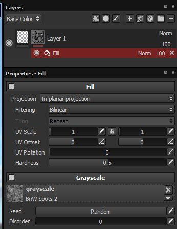

# Preenchimento

Os efeitos de preenchimento são os mesmos que uma camada de preenchimento, mas podem ser aplicados como um efeito em uma camada ou uma máscara, permitindo criar materiais ou máscaras mais complexos em uma única camada.

