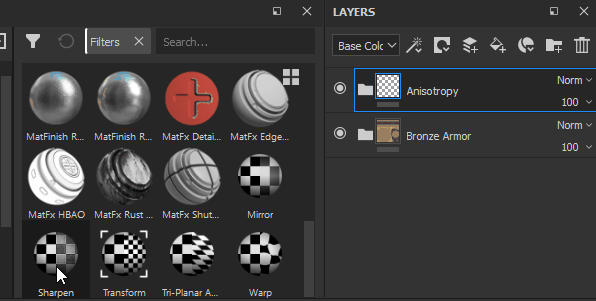

# Filtros

Efeitos de filtro são substâncias que transformam o conteúdo de uma camada ou máscara. Com o modo de mesclagem Transparência, uma camada pode modificar os resultados da pilha de camadas. Assim, o uso de um filtro em uma camada com o modo de mesclagem Transparência permite usar filtros para modificar a pilha de camadas como um todo.

## Como posso aplicar um filtro?

Dependendo do tipo de filtro, um efeito de filtro deve ser criado no conteúdo ou na máscara de uma camada. Há duas maneiras de aplicar um filtro:

* A abordagem manual requer várias etapas para configurar o filtro, mas fornece controle direto sobre cada etapa do processo.
* A abordagem de arrastar e soltar permite adicionar um filtro rapidamente e define automaticamente o modo de mesclagem para passagem em todos os canais.

### Adicionar um filtro manualmente

No exemplo a seguir, um filtro de desfoque é aplicado ao conteúdo de uma camada, mas é usado com mais frequência para aplicar filtros a máscaras:

**1. Adicionar um efeito de filtro**

Comece selecionando o conteúdo de uma camada ou a máscara de camada e clique no botão **Efeito** (ou clique com o botão direito para abrir o menu de contexto). Selecione a opção &quot; **Adicionar filtro** &quot; na lista.

**2. Selecione o filtro na janela de propriedades**

No **painel Propriedades**, nenhum filtro foi selecionado ainda. Clique no botão Seleção de filtro para abrir a miniprateleira e selecionar o filtro desejado. Aqui será escolhido o **Filtro de desfoque**.

>[!NOTE]
>
> Ao aplicar um filtro manualmente, lembre-se de que talvez você precise usar o modo de mesclagem de passagem se quiser que o filtro afete o conteúdo das camadas abaixo dele.

## Arrastar e soltar um filtro da prateleira

Esse método destina-se apenas a filtros que devem ser aplicados a toda a pilha de camadas. Ela definirá automaticamente todos os [Modos de mesclagem](../../interface/layer-stack/blending-modes.md) do canal. Isso não funciona para aplicar filtros a uma máscara.

**1. Abrir a área Filtros da Prateleira**

Na prateleira, clique na seção “Filtros” à esquerda.

**2. Arraste e solte o filtro**

Selecione o filtro que deseja usar na prateleira. Arraste-o e solte-o na pilha de camadas, garantindo que ele seja colocado no local correto (evite soltá-lo em grupos indesejados, por exemplo).

Observe, no exemplo acima, que o filtro solto já tem um modo de Mesclagem de Transparência. Isso é verdadeiro para todos os canais do documento.

## Adicionar novos filtros ao Painter

Se você tiver novos filtros para trazer para o Painter, poderá adicioná-los assim como adicionaria recursos padrão, bastando arrastar e soltar o arquivo SBSAR no **Painel Ativos** para gerenciar a importação dos novos filtros.

## Crie seus próprios filtros

Todos os filtros são Substance, que podem ser criados com o Substance 3D Designer. A Substance 3D Designer fornece modelos para o Substance 3D Painter para ajudar você a começar rapidamente.

Para obter mais informações, consulte esta página: [Criando efeitos personalizados](../../content/creating-custom-effects/creating-custom-effects.md)

## Filtros padrão no Painter

### Padrão

* [Desfoque](filters/standard/blur.md)
* [Desfoque direcional](filters/standard/blur-directional.md)
* [Desfocar Inclinação](filters/standard/blur-slope.md)
* [Grampo](filters/standard/clamp.md)
* [Equilíbrio de cores](filters/standard/color-balance.md)
* [Correção de cores](filters/standard/color-correct.md)
* [Luminosidade de contraste](filters/standard/contrast-luminosity.md)
* [Sombra projetada](filters/standard/drop-shadow.md)
* [Cor da área de preenchimento](filters/standard/fill-area-color.md)
* [Máscara de área de preenchimento](filters/standard/fill-area-mask.md)
* [FXAA (suavização de borda)](filters/standard/fxaa-anti-aliasing.md)
* [Brilho](filters/standard/glow.md)
* [Gradiente](filters/standard/gradient.md)
* [Dinâmica de gradiente](filters/standard/gradient-dynamic.md)
* [Conversão em tons de cinza](filters/standard/grayscale-conversion.md)
* [Highpass](filters/standard/highpass.md)
* [Varredura de histograma](filters/standard/histogram-scan.md)
* [Deslocamento do histograma](filters/standard/histogram-shift.md)
* [Percepção do HSL](filters/standard/hsl-perceptive.md)
* [Inverter](filters/standard/invert.md)
* [Espelhar](filters/standard/mirror.md)
* [Pixelizar](filters/standard/pixelate.md)
* [Posterizar](filters/standard/posterize.md)
* [Tornar Nítido](filters/standard/sharpen.md)
* [Smoothstep](filters/standard/smoothstep.md)
* [Limite](filters/standard/threshold.md)
* [Transformação](filters/standard/transform.md)
* [Distorcer](filters/standard/warp.md)

### Finaliza

* [MatFinish Pincel Linear](filters/finishes/matfinish-brushed-linear.md)
* [MatFinish galvanizado](filters/finishes/matfinish-galvanized.md)
* [MatFinish Granulado](filters/finishes/matfinish-grainy.md)
* [MatFinish moído](filters/finishes/matfinish-grinded.md)
* [MatFinish Hammered](filters/finishes/matfinish-hammered.md)
* [Círculos perfurados MatFinish](filters/finishes/matfinish-perforated-circles.md)
* [MatFinish pó revestido](filters/finishes/matfinish-powder-coated.md)
* [MatFinish Raw](filters/finishes/matfinish-raw.md)
* [MatFinish Rough](filters/finishes/matfinish-rough.md)

### MatFX

* [MatFX Comic Book](filters/matfx/matfx-comic-book.md)
* [Edge Wear de Detalhes do MatFX](filters/matfx/matfx-detail-edge-wear.md)
* [Danos de Borda do MatFX](filters/matfx/matfx-edge-damages.md)
* [MatFX HBAO](filters/matfx/matfx-hbao.md)
* [MatFX Oil Tinta](filters/matfx/matfx-oil-paint.md)
* [Tinta de Descascamento do MatFX](filters/matfx/matfx-peeling-paint.md)
* [Ferrugem de Weathering MatFX](filters/matfx/matfx-rust-weathering.md)
* [Linha de Fechamento do MatFX](filters/matfx/matfx-shut-line.md)
* [MatFX Watercolor](filters/matfx/matfx-watercolor.md)
* [Gotas de água MatFX](filters/matfx/matfx-water-drops.md)

### Iluminação

* [Ambiente de iluminação baked](filters/lighting/baked-lighting-environment.md)
* [Iluminação feita bake Estilizada](filters/lighting/baked-lighting-stylized.md)

### Avançado

* [Kuwahara anisotrópico](filters/advanced/anisotropic-kuwahara.md)
* [Chanfro](filters/advanced/bevel.md)
* [Suavização de chanfro](filters/advanced/bevel-smooth.md)
* [Correspondência de cores](filters/advanced/color-match.md)
* [Distância direcional](filters/advanced/directional-distance.md)
* [Curva de gradiente](filters/advanced/gradient-curve.md)
* [Ajuste de height](filters/advanced/height-adjustments.md)
* [Height para normal](filters/advanced/height-to-normal.md)
* [Contorno da máscara](filters/advanced/mask-outline.md)
* [Validação do PBR](filters/advanced/pbr-validate.md)
* [Quantize](filters/advanced/quantize.md)
* [Estilização](filters/advanced/stylization.md)
* [Avançado Tri-Planar](filters/advanced/tri-planar-advanced-filter.md)
