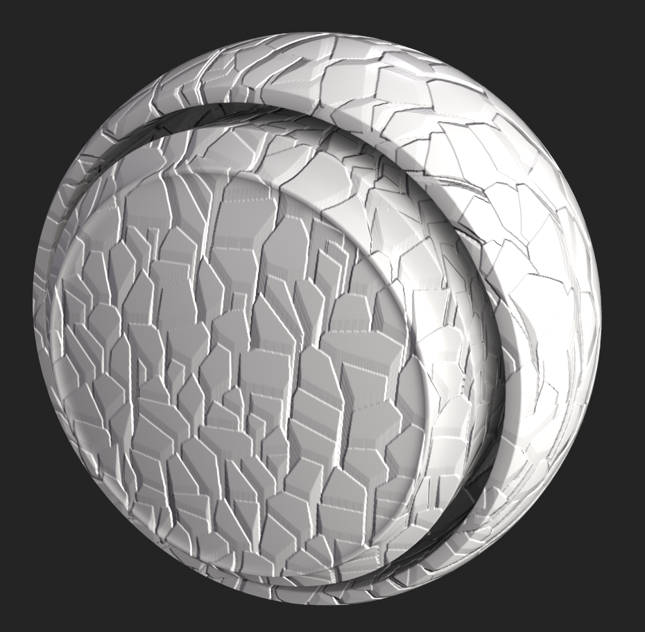
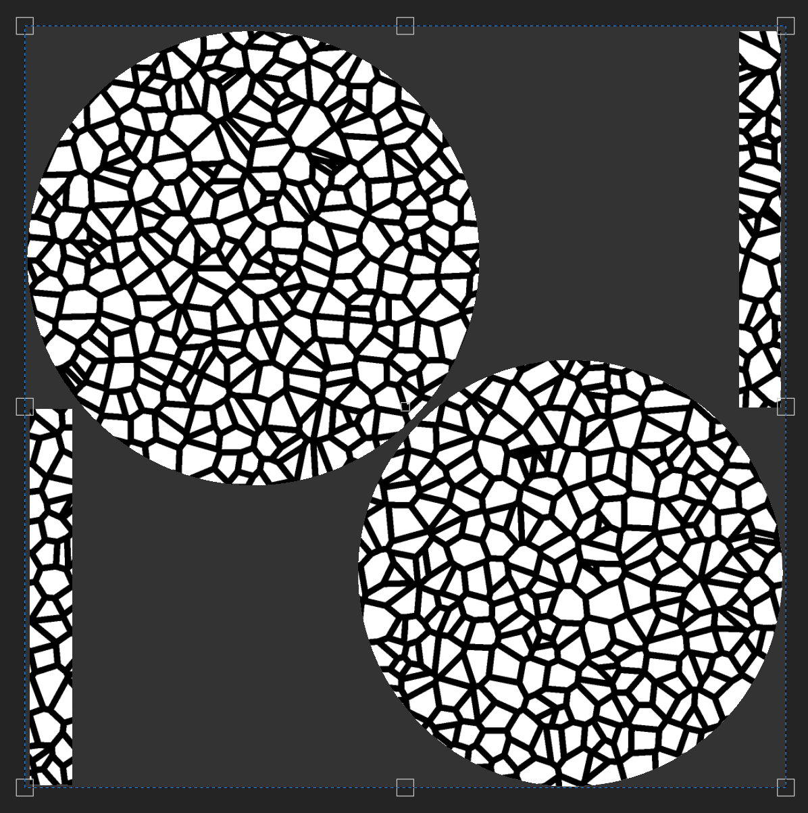

# Distância direcional

<table>
  <tr style="border: 0;">
    <td style="border: 0;" valign="top"> <strong>Entrada:</strong> efeitos/cor, distância, direcional, vazamento, chuva</td>
    <td style="border: 0;" valign="top">Descrição O filtro de Distância direcional cria um gradiente de distância que viaja em uma direção escolhida. É usado em uma camada de textura para criar listras direcionais, vazamentos e outros efeitos baseados na distância. Também é possível usar o filtro de Distância direcional como máscara para o canal de height, de modo a adicionar dimensionalidade a seu canal normal.</td>
  </tr>
</table>

## Entradas

| Nome de entrada | Descrição |
| --- | --- |
| **Mapa de distância:** tons de cinza | Use uma textura personalizada ou um ponto de ancoragem. |

## Parâmetros

| Nome do parâmetro | Descrição |
| --- | --- |
| **Distância:** | Ajuste a distância percorrida pelo gradiente de distância no espaço normalizado da imagem, onde 1 é o comprimento do lado mais curto da imagem de entrada. |
| **Ângulo:** | Ajuste a direção do gradiente de distância em curvas, onde 0 aponta horizontalmente para a direita ou ao longo de um vetor (1,0). |
| **Contraste:** | Ajuste o contraste ou a queda do resultado. |
| **Multiplicador de Mapa de distância:** | Ajuste o quanto o Mapa de distância afeta a distância máxima. Esse parâmetro não tem efeito quando a entrada do Mapa de distância não está conectada. |

## Exemplos

No exemplo abaixo, usamos o filtro Distância direcional para fazer com que o gerador do Células 2 pareça tridimensional.

Isso é feito criando uma camada de preenchimento com o canal de height ativado e definido com um valor de 1.

Em seguida, adicione uma máscara preta à camada de preenchimento e, na máscara, adicione um preenchimento com a escala de cinza definida como **Células 2**. Isso cria a seguinte máscara.

>[!NOTE]
>
> Você pode exibir a máscara na **Janela de visualização** mantendo pressionada a tecla Alt e clicando no ícone de máscara, ou com a camada de preenchimento selecionada, use o menu suspenso de canais na **Porta de visualização** para selecionar a **Máscara**.

Em seguida, adicione um Filtro à máscara e selecione o filtro Distância direcional.

Ajuste as configurações de Filtro para o resultado desejado, mas a máscara deve ser semelhante ao exemplo abaixo.

Alterne novamente para a exibição de material para ver o efeito na Janela de visualização.
