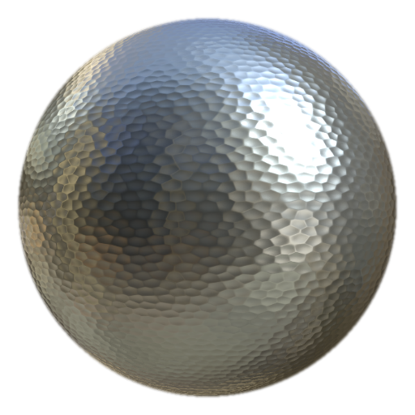

# MatFinish Hammered

<table>
<tr style="border: 0;">
<td width="33.33%" style="border: 0;" valign="top">

<b>Em:</b> efeitos/término, superfície

</td>
<td width="100.00%" style="border: 0;" valign="top">

## Descrição

O filtro Martelo MatFinish faz parte de uma coleção de acabamentos de metal e é usado para criar um efeito de metal martelado.

É usado em uma camada de preenchimento. Ajuste a cor, a aspereza, o metal e outras propriedades da camada de preenchimento de base e, em seguida, adicione o filtro para o tratamento de superfície final.

</td>
</tr>
</table>

## Entradas

| Nome de entrada | Descrição |
| --- | --- |
| <b>Posição:</b> Cor | Use o mapa de Posição feita bake. |
| <b>Normais do Espaço Mundial:</b> Cor | Use o mapa do World Space Normals feito bake. |

## Parâmetros

| Nome do parâmetro | Descrição |
| --- | --- |
| <b>Semente:</b> | Atribua um valor aleatório para criar uma variação diferente sem alterar as configurações gerais. |
| <b>Escala:</b> | Ajuste a escala geral do acabamento. |
| <b>Intensidade dos detalhes:</b> | Ajuste a intensidade dos detalhes da superfície. |
| <b>Mapeamento Triplanar:</b> | Alternar mapeamento triplanar. |
| <b>Rotação:</b> | Ajuste a rotação do padrão martelado. |

