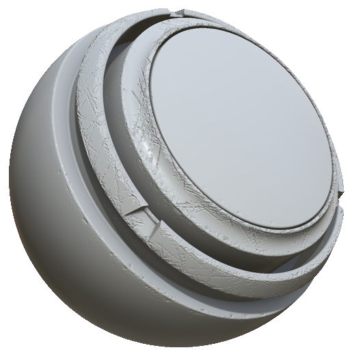

# Danos de Borda do MatFX

<table>
<tr style="border: 0;">
<td width="33.33%" style="border: 0;" valign="top">

<b>Entrada:</b> efeitos/desfoque, tons de cinza

</td>
<td width="100.00%" style="border: 0;" valign="top">

## Descrição

O filtro Danos de Borda do MatFX cria detalhes de borda danificados e lascados. O Dano de borda se comporta de maneira diferente do filtro Edge Wear de Detalhes MatFX, pois o dano de borda não altera a cor da área danificada. Isso significa que ele pode ser mais útil para simular danos a materiais como plástico ou resina, em vez de Edge Wear, que é melhor usado para materiais como metal pintado.

O MatFX Edge Damages é usado em camadas de textura ou pilhas de materiais para adicionar detalhes de bordas gastas, arranhadas e danificadas.

</td>
</tr>
</table>

>[!NOTE]
>
> Para que o filtro Danos de borda do MatFX modifique o canal do height, é necessário que haja dados de height no canal. Em outras palavras, se não houver camadas abaixo da camada de filtro com dados de height, o filtro não terá um efeito observável no canal de height.

## Parâmetros

| Nome do parâmetro | Descrição |
| --- | --- |
| <b>Intensidade de desfoque:</b> | Ajuste a intensidade do efeito de desfoque. |
| <b>Quebra automática de linha:</b> | Alternar quebra automática de desfoque. Quando ativado, o efeito obtém amostras de pixels do lado oposto da textura. |
| <b>Nível:</b> | Ajuste o nível de dano geral. |
| <b>Contraste:</b> | Ajuste o contraste ou a queda do resultado. |
| Intensidade de <b>Scratches:</b> | Ajuste a intensidade dos arranhões. |
| <b>Aspereza de danos:</b> | Ajuste a aspereza das áreas danificadas. |
| <b>Profundidade de danos:</b> | Ajuste a profundidade das áreas danificadas. |
