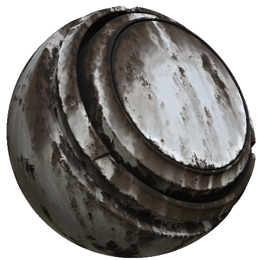

# Ferrugem de Weathering MatFX

<table>
<tr style="border: 0;">
<td width="33.33%" style="border: 0;" valign="top">

<b>Entrada:</b> efeitos/desfoque, tons de cinza

</td>
<td width="100.00%" style="border: 0;" valign="top">

## Descrição

O filtro de Envelhecimento de Ferrugem do MatFX cria acúmulo e envelhecimento de ferrugem em um material.

É usado em camadas de textura ou pilhas de materiais para adicionar corrosão, gotas e efeitos de intemperismo envelhecido.

</td>
</tr>
</table>

## Parâmetros

| Nome do parâmetro | Descrição |
| --- | --- |
| <b>Intensidade de desfoque:</b> | Ajusta a intensidade do efeito de desfoque. |
| <b>Quebra automática de linha:</b> | Ativa ou desativa o desfoque. Quando o desfoque está sobre ele, obtém amostras de pixels do lado oposto da textura. |
| <b>Propagação de Ferrugem:</b> | Ajuste a propagação de ferrugem. |
| <b>Espalhando Smoothness:</b> | Ajuste a difusão de smoothness. |
| <b>Escala de danos de verniz:</b> | Ajuste a escala de danos do verniz. |
| <b>Intensidade de gotas:</b> | Ajuste a intensidade de gotejamento. |
| <b>Quantidade de Amostras de Gotas:</b> | Ajuste a quantidade de amostras de gotas. |
| <b>Smoothness de gotas:</b> | Ajuste o smoothness de gotas. |

### Mesclagem

| Nome do parâmetro | Descrição |
| --- | --- |
| <b>Intensidade Normal:</b> | Ajuste a intensidade de mesclagem do mapa normal. |
| <b>Intensidade de Oclusão de ambiente:</b> | Ajuste a intensidade de mesclagem do mapa do AO. |
| <b>Intensidade do Height:</b> | Ajuste a intensidade de mesclagem do mapa de altura. |

**Aspereza metálica**

| Nome do parâmetro | Descrição |
| --- | --- |
| <b>Intensidade de Cor de base:</b> | Ajuste a intensidade da cor de base. |
| <b>Intensidade de aspereza:</b> | Ajuste a intensidade de mistura do mapa de aspereza. |
| <b>Intensidade Metálica:</b> | Ajuste a intensidade de mesclagem do mapa metálico. |
