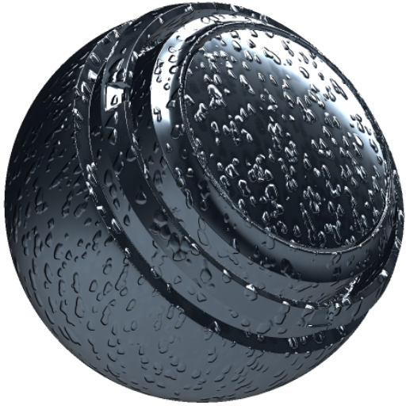

# Gotas de água MatFX

<table>
<tr style="border: 0;">
<td width="33.33%" style="border: 0;" valign="top">

<b>Entrada:</b> efeitos/desfoque, tons de cinza

</td>
<td width="100.00%" style="border: 0;" valign="top">

## Descrição

O filtro Gotas de Água MatFX cria efeitos de gotícula e escoamento de água em um material.

É usado em camadas de textura ou pilhas de materiais para adicionar gotas, listras direcionais e variação de superfície molhada.

</td>
</tr>
</table>

## Entradas

| Nome de entrada | Descrição |
| --- | --- |
| <b>Oclusão de ambiente:</b> tons de cinza | Use o mapa de oclusão de ambiente feito bake. |
| <b>Normais do Espaço Mundial:</b> Cor | Use o mapa de normais do espaço global feito bake. |
| <b>Posição:</b> Cor | Use o mapa de posição feito bake. |

## Parâmetros

| Nome do parâmetro | Descrição |
| --- | --- |
| <b>Valor de Quedas:</b> | Ajuste a quantidade de água que cai. |
| <b>Quedas na Escala X:</b> | Ajuste a escala de X das gotas. |
| <b>Escala de quedas Y:</b> | Ajuste a escala de Y das gotas. |
| <b>Escala de Descartes Aleatória:</b> | Ajuste a quantidade de variação de escala aleatória nos pingos. |
| <b>Intensidade de Direção da Queda:</b> | Ajuste a intensidade direcional das gotas. |

### Posição

| Nome do parâmetro | Descrição |
| --- | --- |
| <b>Influência X:</b> | Ajuste a influência X da entrada de posição. |
| <b>Influência Y:</b> | Ajuste a influência Y da entrada de posição. |
| <b>Influência Z:</b> | Ajuste a influência Z da entrada de posição. |

### Acúmulo de água

| Nome do parâmetro | Descrição |
| --- | --- |
| <b>Intensidade:</b> | Ajuste a intensidade da acumulação de água. |
| <b>Propagação:</b> | Ajuste a propagação da acumulação de água. |
| <b>Intensidade baseada em AO:</b> | Ajuste quanto a oclusão de ambiente afeta o acúmulo de água. |

### Espaço global

| Nome do parâmetro | Descrição |
| --- | --- |
| <b>Intensidade de mascaramento:</b> | Ajuste a intensidade do mascaramento do espaço global. |
| <b>Intensidade Superior:</b> | Ajuste a intensidade das quedas nas áreas voltadas para cima. |
| <b>Intensidade Inferior:</b> | Ajuste a intensidade das quedas nas áreas voltadas para baixo. |
| <b>Intensidade frontal:</b> | Ajuste a intensidade das gotas nas áreas frontal. |
| <b>Intensidade do Fundo:</b> | Ajuste a intensidade das quedas nas áreas viradas para trás. |
| <b>Intensidade da direita:</b> | Ajuste a intensidade das quedas nas áreas voltadas para a direita. |
| <b>Intensidade da esquerda:</b> | Ajuste a intensidade das gotas nas áreas voltadas para a esquerda. |

### Material

| Nome do parâmetro | Descrição |
| --- | --- |
| <b>Intensidade de Distorção de Cor de base de Gotas:</b> | Ajuste a intensidade de distorção aplicada à cor de base sob as gotas. |
| <b>Descartes do Multiplicador do Mapa Vetorial de Rotação:</b> | Ajuste o multiplicador aplicado ao mapa vetorial de rotação para soltar. |
| <b>Intensidade de Descarte do Height:</b> | Ajuste a intensidade do efeito de height de soltar. |
| <b>Aspereza das gotas:</b> | Ajuste a aspereza das gotas. |
| <b>Mesclagem de aspereza de queda:</b> | Ajuste como a aspereza da gota se mescla com o material. |
| <b>Gotas Metálicas:</b> | Ajuste o valor metálico das gotas. |
| <b>Descartes de Mesclagem Metálica:</b> | Ajuste como o valor metálico da gota se mescla com o material. |
| <b>Intensidade Normal:</b> | Ajuste a intensidade do efeito normal. |
