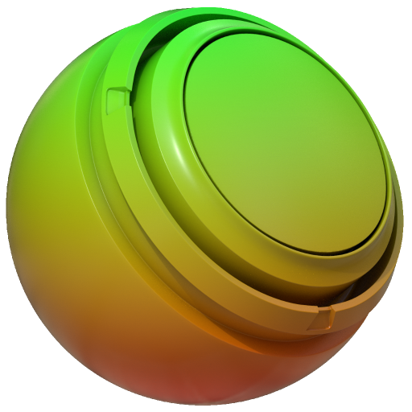

# Densidade do texel UV

<table>
  <tr style="border: 0;">
    <td style="border: 0;" valign="top"> <strong>Em:</strong> uv, tamanho, utilitário</td>
    <td style="border: 0;" valign="top"><strong>Descrição</strong> O gerador de Densidade de Texel UV visualiza a densidade de texel de uma malha aplicando um gradiente colorido de baixo para alto. O Gerador de Densidade de Texel UV gera uma textura de cor completa e é melhor usado em uma camada de preenchimento para identificar dimensionamento UV inconsistente e garantir detalhes de textura uniformes em um modelo.</td>
  </tr>
</table>

>[!NOTE]
>
> Densidade de texel refere-se ao número de texels (pixels de textura) em uma determinada área de superfície do modelo. Uma alta densidade de texel significa que você pode compactar muitos detalhes em uma pequena área do seu modelo, onde uma baixa densidade de texel pode limitar a quantidade de detalhes, mas melhorar o desempenho. Em geral, independentemente da resolução dos materiais, é recomendado manter uma densidade de texel consistente em toda a malha, pois grandes diferenças na densidade de texel são frequentemente perceptíveis aos espectadores e podem fazer com que um ativo pareça de qualidade inferior ou menos realista.

## Parâmetros

| Nome do parâmetro | Descrição |
| --- | --- |
| **Cor baixa** | Defina a cor usada para áreas com **baixa** densidade de texel. |
| **Cor média** | Defina a cor usada para áreas com densidade de texel **média**. |
| **Cor Alta** | Defina a cor usada para áreas com **alta** densidade de texel. |
