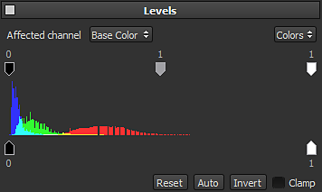

# Níveis

O nível é um efeito usado para ajustar as faixas de cores de uma imagem. Permite equilibrar e tonificar cores e/ou valores de tons de cinza. Você pode adicioná-lo abrindo o menu de efeitos:

A interface principal exibe um histograma (a montanha de cores no meio da interface) que é a representação de como os pixels são distribuídos em uma imagem em cada nível de intensidade de cor. O histograma mostra detalhes nas sombras (parte esquerda), meios-tons (parte central) e realces (parte direita). O histograma também oferece uma rápida visão da gama tonal das cores, permitindo determinar o quão escura ou brilhante a imagem está.

Para ajustar a gama de cores da imagem, dois conjuntos de controles estão disponíveis nas partes superior e inferior do histograma:

* Os três botões superiores controlam as sombras, os meios-tons e os realces e podem ser usados para redistribuir a gama tonal para contrastar a imagem geral.
* Os dois botões inferiores controlam o preto e o ponto branco da imagem (geralmente 0 e 255). Isso pode ser útil para inverter as cores de uma imagem, por exemplo.

>[!NOTE]
>
> O efeito de níveis só pode ser aplicado a um canal por vez, conforme selecionado pela opção *Canal afetado*. Se você deseja aplicar um nível em vários canais, terá que criar vários efeitos de Níveis.

* A caixa suspensa Cores no canto superior direito permite alterar os níveis na imagem rgb completa ou em apenas um dos canais vermelho, verde e azul.
* A opção Grampeamento na parte inferior direita permite fixar os valores dos níveis entre 0 e 1 (0-255). Essa opção deve ser sempre marcada ao trabalhar em canais não HDR (como a **Cor base**).

[Para entender ainda mais os Níveis, você deve assistir ao nosso curso na Substance Academy dedicado ao tema.](https://academy.substance3d.com/courses/Mastering-Levels-Histogram)
