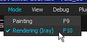

# Renderizador Iray

{width="600px"}

**Iray** é um renderizador de caminho rastreado acelerado por GPU desenvolvido pela [Nvidia](http://www.nvidia.com/object/nvidia-iray.html).\
Com o Iray é possível criar imagens com grande precisão de iluminação na cena e em alta definição (grande resolução).

## Modo Iray

Para iniciar o Iray, é necessário alterar o modo de Substance 3D Painter.\
Isso pode ser feito pressionando-se de várias maneiras:

* Pressionando a **tecla F10** (ou **F9** para voltar para o modo Pintura)
* Clicando no ícone Câmera na barra de ferramentas principal
* Usando o menu Modo

<table>
<tr style="border: 0;">
<td style="border: 0;" valign="top">

</td>
<td style="border: 0;" valign="top">

</td>
</tr>
</table>

## Parâmetros do Lray

O Iray usa um conjunto específico de parâmetros, mas também propriedades comuns compartilhadas pelo visor normal do Substance 3D Painter.

* [Configurações do Iray](iray-settings.md)
* [Visualizador e Configurações de MDL](viewer-and-mdl-settings.md)

## Configurações do visor

As Configurações de exibição permitem controlar as configurações da câmera e do pós-efeito.\
Eles são idênticos à renderização normal do visor, portanto permitem que estejam em sincronia e evitam diferenças indesejadas de iluminação.

Para obter mais detalhes, consulte a página dedicada: [Configurações de exibição](../../interface/display-settings/display-settings.md)
