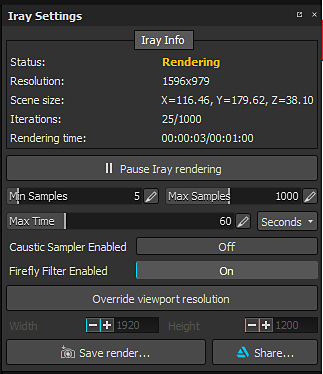

# Configurações do Iray

As configurações do Iray controlam a renderização do visor do IRay, o tempo de execução e a qualidade dele.

## Informações do Iray

A seção superior da janela exibe o status de Iray ao lado de outras informações.

| *Configuração* | *Descrição* |
| --- | --- |
| **Status** | O status indica como Iray está funcionando:<ul data-preserve-html="true"><li data-preserve-html="true"><strong>Renderizando</strong> (Iray está computando a imagem)</li><li data-preserve-html="true"><strong>Pausado</strong> (Iray computado interrompido mas não concluído)</li><li data-preserve-html="true"><strong>Concluído</strong> (computação de Iray concluída ou valores de configurações atingidos)</li></ul> |
| **Resolução** | A resolução da imagem da Iray (por padrão, dependente do tamanho do visor). |
| **Tamanho da cena** | O tamanho da caixa delimitadora da cena/malha 3D. Não há unidade, mas supõe-se que ela esteja em centímetros. |
| **Iterações** | O número de passagens de computação realizadas pelo Iray acima do máximo definido nas configurações. |
| **Tempo de renderização** | O tempo decorrido durante a renderização ultrapassou o tempo máximo definido nas configurações. |

>[!NOTE]
>
> O número de iterações definirá a qualidade final da renderização: mais iterações = melhor qualidade.\
> No entanto, as iterações podem levar algum tempo, razão pela qual é possível definir um tempo máximo. Uma iteração é definida pelo número de amostras.

## Configurações

Assim que uma configuração for modificadora, o Iray começará a calcular a renderização.\
É possível pausar Iray para evitar este comportamento com o botão dedicado :

| *Configuração* | *Descrição* |
| --- | --- |
| **Amostra mínima** | Quantidade mínima de amostras executadas por pixels |
| **Amostra Máxima** | Quantidade máxima de amostras executadas por pixels |
| **Tempo Máximo** | O tempo máximo permitido para o Iray realizar seu cálculo.  O menu suspenso à direita permite ajustar a unidade (segundos, minutos ou horas). |
| **Sampler Caustico Habilitado** | Esta opção permite calcular reflexos de iluminação mais avançados (cáustica). |
| **Filtro de Firefly Habilitado** | Esta opção permite livrar-se de pixels isolados e muito brilhantes que podem acontecer às vezes. |
| **Substituir resolução do visor** | Essa configuração permite definir um tamanho personalizado para a renderização, em vez de usar o tamanho do visor atual. A configuração **Largura** e **Height** abaixo permitem defini-lo em uma quantidade de pixels. |
| **Salvar Renderização** | Ação para exportar a renderização atual (mesmo que não terminada) para um arquivo. |
| **Compartilhar** | Permitir o compartilhamento/exportação da renderização atual para [ArtStation](https://www.artstation.com/). |
