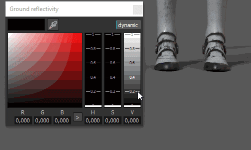

# Visualizador e Configurações de MDL

{width="400px"}

## Ambiente

Idêntico ao visor normal, o mapa de ambiente usado no Iray controlará a iluminação.\
O mapa de ambiente pode ser alterado clicando no botão ou arrastando e soltando uma textura HDR nele.

* **Exposição do Ambiente** : controla o nível de exposição do mapa de ambiente HDR.
* **Rotação do ambiente** : para deslocar a textura do ambiente e girar a iluminação ao redor da cena.

>[!NOTE]
>
> Sendo o Iray um renderizador baseado fisicamente, a textura do ambiente definirá muito a iluminação e a aparência da cena.

## Domo

A cúpula é a forma sobre a qual será projetado o mapa ambiental em segundo plano.\
Três tipos de cúpula estão disponíveis, dependendo da cena:

* **Esfera infinita**: o ambiente é projeto em segundo plano em uma esfera para simular o horizonte, sempre longe da cena
* **Esfera** : o ambiente é projetado em uma esfera regular, que pode ser dimensionada
* **Esfera com chão** : semelhante à forma anterior, esta também tem um controle para nivelar a parte inferior da esfera para simular um piso.

>[!NOTE]
>
> A esfera com solo tem um controle para definir o tamanho/raio do piso, no entanto, um raio grande criará distorções no ambiente.\
>  Dependendo do tipo escolhido, a iluminação pode ser afetada.

Configurações adicionais estão disponíveis:

| *Configuração* | *Descrição* |
| --- | --- |
| **Raio** | O tamanho da esfera (se não for infinito) |
| **Escala de textura** | Quanto a textura será esticada para o tipo **Esfera com terra**. |
| **Limpar cor** | Se ativada, substitua a imagem de fundo do mapa de ambiente por uma cor uniforme. Isso afetará a iluminação. |

### Configurações do solo

As configurações do solo permitem especificar onde um piso está localizado.\
Por padrão, o valor é definido para fixar a parte inferior da caixa delimitadora da cena.

| ***Configuração*** | ***Descrição*** |
| --- | --- |
| **Valor X, Y, Z** | Defina a localização do piso nos três eixos.   O valor 0,0,0 corresponde ao meio da caixa delimitadora da cena. |
| **Refletividade** | Define a intensidade e a cor do reflexo do solo.   Um valor de brilho branco significa que o solo reflete 100%, enquanto preto significa não refletir. 

 |
| **Textura reluzente** | Define o quão brilhante (ou áspero) é o reflexo. 

 |
| **Intensidade da sombra** | Esse parâmetro define a opacidade final da sombra depois que a iluminação é calculada. |
| **Visível de baixo** | Define se o solo é visível de baixo ou não. Se marcada, significa que o chão irá ocultar qualquer elemento acima dele. |

## Parâmetros MDL e Shader

Iray usa MDL para definir os materiais usados para a renderização de um objeto. Para obter mais informações, consulte a [página oficial da NVIDIA no formato](http://www.nvidia.com/object/material-definition-language.html) .

Por padrão, no Substance 3D Painter, um MDL é associado a um sombreador GLSL; permite alternar entre a viewport regular e o Iray sem precisar configurar nada.\
Os parâmetros do MDL são exibidos na parte inferior das configurações do visualizador. Abaixo estão os parâmetros do MDL default (Compatível com o sombreador de aspereza/metálico do PBR).

>[!NOTE]
>
> Para carregar MDLs personalizados, é necessário um sombreador glsl personalizado.\
>  No sombreador, alguns metadados podem ser adicionados para especificar o caminho mdl:
> 
> //- Declarar o material mdl da matriz a ser usado com este sombreador. //: metadados { //: “mdl”:”mdl::alg::materials::physical\_metallic\_roughness::physical\_metallic\_roughness” //: }
> 
> * **mdl** : define o material mdl Iray a ser usado com o sombreador. A sintaxe do caminho é a seguinte: *mdl::folder1::folder2::mdl\_filename::material\_name* onde *folder1::folder2::mdl\_filename* é o caminho dentro de uma das pastas de prateleira *mdl* para um arquivo mdl e *::material\_name* é o nome de um material declarado dentro desse arquivo mdl. (ex: “mdl” : “mdl::alg::materials::physical\_metallic\_roughness::physical\_metallic\_roughness”)

>[!NOTE]
>
> Para cada instância de material em um projeto será definido um MDL. Portanto, para separar as propriedades dos materiais entre o Conjunto de texturas, defina uma nova instância de Materiais para configurar separadamente os MDLs.

O MDL padrão do Substance 3D Painter suporta as seguintes propriedades:

| *Configuração* | *Descrição* |
| --- | --- |
| **Intensidade Emissiva** | Multiplicador do canal Emissivo. Um valor alto começará a emitir luz. 

 |
| **Refração** | Controla a quantidade de Refração. |
| **IOR** | Define o índice de refração do material.   Nota: Ar = 1,0, Água = 1,2, Vidro = 1,5. |
| **Dispersão** | Controla a quantidade de luz que é dispersa pela superfície. |
| **Absorção** | Controla a quantidade de luz que é absorvida pela superfície. |
| **Cor de absorção** | Simula as mudanças de cor quando a luz passa pela superfície. |
