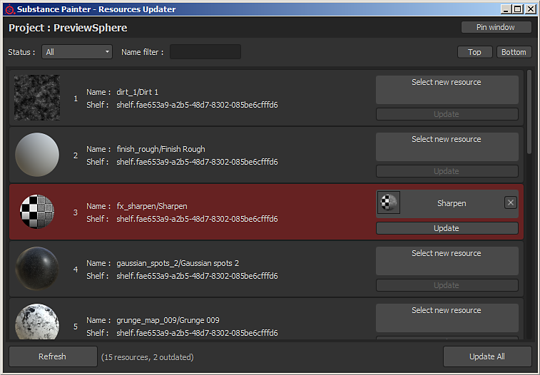

# Atualizador de recursos

O plug-in **Atualizador de Recursos** permite procurar recursos presentes no projeto aberto no momento.\
Cada recurso pode ser substituído por um outro presente na prateleira. O recurso mostrado em vermelho é considerado “desatualizado”, o que significa que uma versão diferente do mesmo recurso está presente na prateleira e é (provavelmente) mais recente.
