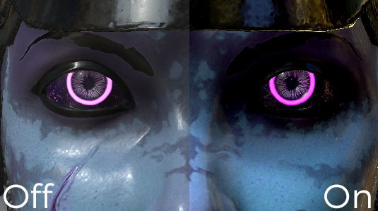

# Correção de cor

Parâmetros de correção de cores :

| *Configuração* | *Descrição* |
| --- | --- |
| **Saturação** | Controla a intensidade/saturação da cor no visor. Use uma saturação em 0 para obter uma renderização em tons de cinza. |
| **Contraste** | Controla a diferença entre cores claras e escuras. |
| **Brilho** | Controla o brilho/luminância das cores. |
| **Polarização** | Desloca globalmente a luminosidade do visor. |
| **Taxa de tons de sépia** | Parâmetro avançado para dar um efeito sépia à janela de visualização. |
| **Temperatura do Equilíbrio de Brancos (K)** | Temperatura das cores, em Kelvins. O padrão é 6500K, correspondente à luz do dia. [Consulte a Wikipédia para obter mais informações](https://en.wikipedia.org/wiki/Color_temperature). |
