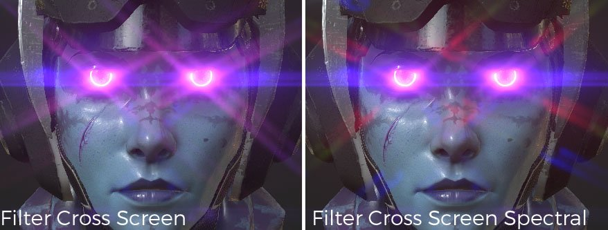

# Brilho

Descrição dos parâmetros :

| Configuração | Descrição |
| --- | --- |
| **Luminância** | Esse é o brilho geral do efeito de brilho. Definir isso como 0.0 desativa completamente o efeito.  Os valores realistas ocorrem no intervalo de aproximadamente 0,5 a 4,0, até um máximo de aproximadamente 16,0. |
| **Limite** | Somente os pixels mais brilhantes do que o limite são extraídos para gerar brilho.  Para resultados de aparência natural, são recomendados valores entre 0,0 e 1,0. |
| **Remapear** **Fator** | Especificar um valor diferente de 1,0 faz com que o componente de alta luminância extraído seja expandido (ou compactado) de forma não linear. Se você ultrapassar um valor superior a 1,0, o brilho se tornará mais intenso em pixels claros.  Use esta opção quando quiser ajustar o mapeamento de luminância do brilho isoladamente, sem afetar outros efeitos. A luminância após a passagem de brilho aumenta em uma curva suave, com valores de luminância de 1,0 aproximando-se do **Fator de Remapeamento** e valores maiores que 1,0 se aproximando do (**Remapeamento** **Fator** ^2). |
| **Forma** | A forma define a aparência do brilho, e diferentes modelos estão disponíveis:<ul data-preserve-html="true"><li data-preserve-html="true"><strong>Bloom</strong> : somente efeito de florescimento.</li><li data-preserve-html="true"><strong>Clarão de lente:</strong> Bloom / fantasmas (clarão de lente) / pós-imagem.</li><li data-preserve-html="true"><strong>Padrão:</strong> digite incluindo um bom equilíbrio de todos os elementos básicos.</li><li data-preserve-html="true"><strong>Lente Barata:</strong> fantasmas e outras representações de uma lente barata. </li><li data-preserve-html="true"><strong>Após a imagem:</strong> digite com uma pós-imagem muito forte. </li><li data-preserve-html="true"><strong>Filtrar tela cruzada:</strong> lente com gerador de filtro de estrela em forma cruzada anexado.</li><li data-preserve-html="true"><strong>Espectro de tela cruzada de filtro</strong>: lente com gerador de filtro de estrela em forma de cruz com espectro forte anexado.</li><li data-preserve-html="true"><strong>Snow de filtro cruzado</strong> : lente com gerador de filtro de estrela em seis direções anexadas.</li><li data-preserve-html="true"><strong>Espectro transversal de Snow de filtro</strong>: lente com gerador de filtro de estrela com espectro forte em seis direções anexadas.</li><li data-preserve-html="true"><strong>Filtrar Cruz Ensolarada</strong> : lente com gerador de filtro de estrela em oito direções anexadas.</li><li data-preserve-html="true"><strong>Filtrar Espectro de Cruz Ensolarada</strong>: lente com gerador de filtro de estrela com espectro forte em oito direções anexadas.</li><li data-preserve-html="true"><strong>Faixa Horizontal</strong> : este tipo de reflexo de flash produz fortes faixas de estrelas horizontais.</li><li data-preserve-html="true"><strong>Faixa vertical</strong>: digite com faixas de estrelas fortes na direção vertical. Manchas para câmera digital CCD, etc.</li></ul> |

## Exemplos de forma

