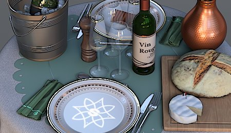

# Tornar Nítido

Melhora as bordas e os detalhes finos da imagem para aumentar a nitidez percebida.

| <b>Parâmetro</b> | <b>Descrição</b> |
| --- | --- |
|  |  |
| --- | --- |
| <b>Valor</b> | Controla a intensidade do efeito de nitidez. Valores mais altos aumentam o contraste da borda de maneira mais expressiva. |
| <b>Diâmetro</b> | Define o tamanho do efeito de nitidez em pixels. Valores menores tornam os detalhes finos mais nítidos; valores maiores afetam bordas mais amplas e podem criar um efeito mais pronunciado. |
