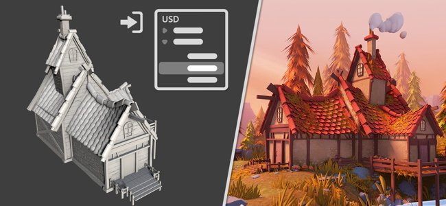

# Universal Scene Description (USD)

O fluxo de trabalho do USD está disponível no Painter 8.3. O [USD](https://graphics.pixar.com/usd/release/intro.html) foi desenvolvido pela Pixar como um formato intercambiável amigável para colaboração que permite transportar muitos tipos diferentes de dados.

No contexto do Painter, agora é possível:

* [Crie um projeto](../getting-started/project-creation.md), usando recursos específicos de USD, como escolha de escopo e variantes, níveis de subdivisão e quadros de animação.
* [Exportar](../export/export-window/export-settings.md) materiais e texturas usando o formato USD.
* Além disso, o USD foi adicionado como um novo formato de arquivo para exportação somente em malha.
