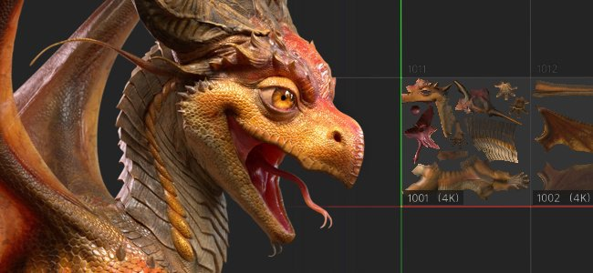

# Blocos UV

Blocos UV são uma maneira de textura mais de um conjunto de texturas, em várias faixas UV, em um conjunto de texturas.

Por padrão, com um fluxo de trabalho tradicional, uma textura é repetida em cada intervalo UV. Com Blocos UV, cada intervalo se torna uma textura dedicada. Esse fluxo de trabalho permite aumentar virtualmente a resolução geral da textura, dividindo os UVs em vários conjuntos de texturas. No momento, os Blocos UV só oferecem suporte à convenção de nomenclatura UDIM.

Para saber mais sobre o fluxo de trabalho do Bloco UV, consulte as seguintes páginas:

* [Criação de projeto](../../getting-started/project-creation.md) com o fluxo de trabalho do Bloco UV.
* Exibindo Blocos UV em [Visualização 2D](../../interface/viewport/2d-view.md).
* [máscara de Bloco UV](../../interface/layer-stack/geometry-mask.md) para melhorar o desempenho.
* Importando e usando [sequências de imagens](image-sequence.md).
* Ajustando a resolução por Bloco UV nas [configurações do Conjunto de Texturas](../../interface/texture-set/texture-set-settings.md).

>[!NOTE]
>
> Trabalhar com projetos de Bloco UV pode ser exigente. Recomendamos o uso de uma SSD para melhorar os tempos de carregamento e o desempenho geral. Também recomendamos configurar o local do cache em uma SSD.
