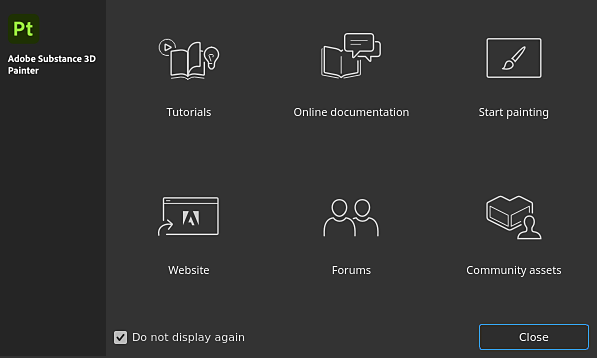

# Introdução

Na <b>tela de boas-vindas</b>, você pode acessar as seguintes páginas:

* [Tutorials](https://www.adobe.com/go/substance3dpaintertutorials_br)
* Documentação online (Você já está aqui!).
* Iniciar pintura: carregue o projeto de amostra “Meet Mat”.
* [Site](https://www.adobe.com/creativecloud/3d-augmented-reality.html)
* [Fóruns](https://community.adobe.com/t5/substance-3d-painter/bd-p/substance-3d-painter?filter=all&page=1&sort=latest_replies)
* [Ativos da comunidade](https://helpx.adobe.com/substance-3d-community-assets/home.html)

Caso contrário, comece com os conceitos básicos de criação de projetos e exportações de textura:

* [Criação de projeto](project-creation.md)
* [Exportar](../export/export.md)
* [Glossário](glossary.md)
* [Desempenho](../technical-support/performances-guidelines/performances-guidelines.md)
* [Ativação e licenças](activation-and-licenses.md)
* [Requisitos do sistema](system-requirements.md)

Para acelerar seu fluxo de trabalho, consulte a lista de atalhos:

* [Atalhos](../interface/settings/shortcuts.md)

{width="500px"}
