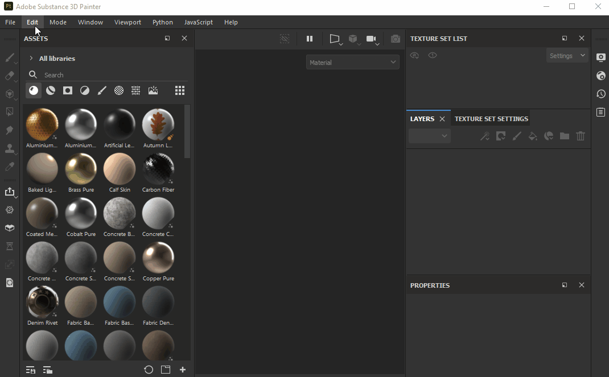

# Adicionando uma nova biblioteca

É possível adicionar um novo local da biblioteca caso você queira alterar o local de importação para algo diferente da pasta Documentos ou já exista uma coleção de ativos no disco que você deseja tornar acessível no Painter.Você pode gerenciar suas bibliotecas por meio do menu Configurações, mas observe que **nenhum projeto deve estar aberto** para usar este menu. Depois que você adicionar uma nova biblioteca ao Painter, ela criará automaticamente as mesmas pastas (vazias) que você vê no local padrão dos ativos (*alfas*, *colorluts*, *efeitos* etc.). Colocar ativos em uma pasta específica atribuirá o uso exato (você pode saber mais [aqui](../../content/importing-assets/adding-content-on-the-hard-drive.md)). Portanto, por exemplo, se você deseja ver suas imagens personalizadas em tons de cinza aparecendo na categoria Alpha na interface do Painter, será necessário colocar essas imagens na pasta *alfas*.

Para adicionar uma nova biblioteca -

1. Abra o Substance 3D Painter sem abrir um projeto.
1. Acesse Editar > Configurações > Bibliotecas.
1. Clique em ... ao lado do campo Caminho e navegue até o local desejado.
1. Insira um novo nome para a biblioteca (observe que espaços e caracteres especiais não são compatíveis e serão convertidos em sublinhados).
1. Clique no botão +.
1. Sua biblioteca deve aparecer na lista.
1. *Opcional:* se desejar que a nova biblioteca seja o local de importação padrão, clique no botão Padrão.

{width="600px"}
