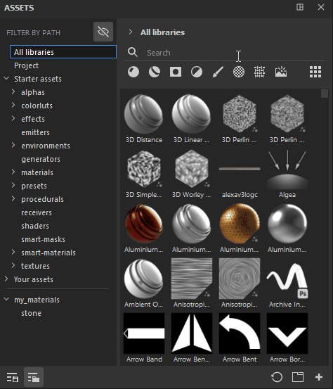

# Filtrar por caminho

**Filtrar por caminho** é uma seção adicional que pode ser usada para navegar pelos seus ativos. Ele tem a mesma estrutura das trilhas, o que significa que permite ver o caminho/local dos ativos.

Por padrão, **Ocultar pastas não aplicáveis** está ativado, o que permite ocultar pastas vazias da interface do usuário. Isso pode ser útil se, por exemplo, você combinar Filtrar por caminho com uma palavra de pesquisa específica ou selecionar um tipo de ativo. Isso permitirá ver apenas os locais relevantes que contêm sua pesquisa.

