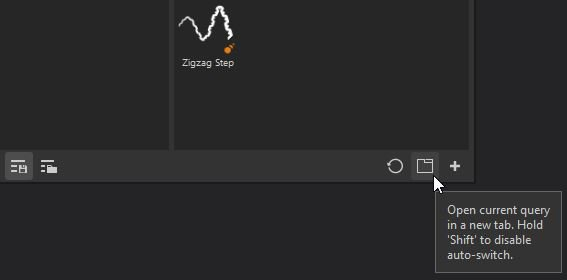

# Guia Sub-biblioteca

Uma subbiblioteca é uma nova guia ou janela no Substance 3D Painter dedicada a uma pesquisa específica.\
Não há uma guia de subbiblioteca aberta por padrão, apenas a janela principal Ativos. Você pode criar guias de subbiblioteca na janela principal Ativos usando dois métodos:

* Ao **clicar com o botão direito do mouse** em uma das pesquisas salvas e escolher **Criar nova guia.**

* Ao **escolher ou inserir uma consulta de pesquisa** (por meio de tipos de ativo, navegação estrutural, consulta de texto ou Filtrar por caminho) e depois usar o **botão** dedicado na parte inferior da janela Ativos.

A criação de uma subbiblioteca criará automaticamente uma nova guia e **a encaixará** na interface dentro do mesmo espaço da janela Ativos principal.

A partir daí, a janela da sub-biblioteca pode ser encaixada em qualquer outro lugar ou deixada flutuando livremente em qualquer lugar na interface ou em outra tela.

>[!NOTE]
>
> * Uma subbiblioteca tem os mesmos recursos que a janela Ativos principal. No entanto, quando redefinida, ela retornará à sua consulta de pesquisa original.
> * Diferentemente da janela principal de ativos, se você fechar uma subbiblioteca, ela precisará ser recriada.
> * Se uma pesquisa salva for removida, a janela da subbiblioteca continuará existindo até que seja fechada.
