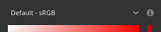
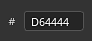
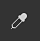
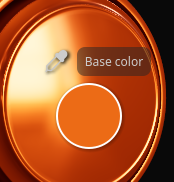
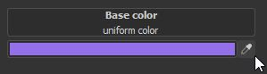
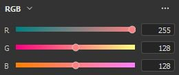
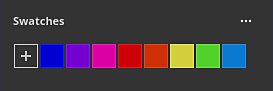

# Seletor de cores

O seletor de cores permite definir uma cor para pintar ou projetar na malha. Ela pode ser usada para selecionar cores de imagens externas ou para ajustar uma existente no aplicativo.

A janela do seletor de cores aparece ao clicar em qualquer campo de cores no Painter, que pode ser encontrado em Propriedades ou em quaisquer configurações ou menus adicionais, como parâmetros de exibição ou de sombreador.

## Visão geral do seletor de cores

Uma vez aberto, o seletor de cores é semipersistente, o que significa que permanecerá aberto até uma alteração de contexto - por exemplo, ao alternar de uma camada de tinta para uma camada de preenchimento. É possível mover a janela e colocá-la em qualquer lugar em qualquer uma das telas disponíveis. No entanto, diferentemente de outras janelas, o seletor de cores não pode ser encaixado.

A janela tem um layout vertical e é composta por três seções:

* Seletor de gradiente (ou espectro)
* Controles deslizantes (RGB/HSV)
* Amostras

{width="200px"}

### Seletor de gradiente (espectro)

| Nome e visual | Descrição |
| --- | --- |
| **Seletor de exibição** 

 | Permitir a escolha da exibição a ser usada para editar cores (espectro e controles deslizantes). O valor padrão corresponde ao Display usado pelo visor principal.  **Observação:** esta configuração só está disponível quando o [gerenciamento de cores](../features/color-management/color-management.md) está habilitado. |
| **Espectro** 

 | O controle deslizante vertical é o matiz geral. Permite selecionar o tom de cor a ser exibido no campo de gradiente.Depois que o tom geral é selecionado, é possível segurar e arrastar o cursor de mira no campo de gradiente para selecionar a cor desejada.  **Observação:** quando o [gerenciamento de cores](../features/color-management/color-management.md) estiver habilitado, as cores HDR da exibição atual serão fixadas (no espaço de cores de trabalho). Isso serve para evitar o valor de saída HDR em canais com gerenciamento de cores. |
| **Cores atual e anterior** 

 | O retângulo esquerdo indica a cor final que será saída do seletor de cores.O retângulo à direita mostra a cor anterior (quando o seletor de cores foi aberto). É possível clicar nela para restaurar a cor anterior e torná-la a atual. |
| **Campo hexadecimal** 

 | Os campos hexadecimais representam a cor atual como valores hexadecimais. Os componentes RGB são representados como um par de letras.Por exemplo, #FF0000 representa a cor vermelha.  **Observação:** quando o [gerenciamento de cores](../features/color-management/color-management.md) está habilitado, o campo hexadecimal sempre funciona no espaço de cores sRGB padrão para facilitar a cópia/colagem de valores entre softwares, independentemente da exibição atual ou do espaço de trabalho usado pelo projeto. |
| **Conta-gotas** 

 | O conta-gotas pode ser usado para escolher uma cor de uma origem externa. Para usá-lo, **clique** no ícone, mova o mouse e, novamente, para copiar a cor desejada.  **Observação:** ao selecionar uma cor dentro do visor, é possível usar o modificador **Shift** para escolher o canal atual editado diretamente. Isso evita a conversão de cores com perdas entre a textura original e a cor exibida na tela. Isso também é útil para escolher cores sem precisar alternar do modo de exibição **Material**. 

  **Observação:** os campos de cores também possuem um conta-gotas ao lado deles e podem ser usados para escolher rapidamente as cores sem que seja necessário abrir o seletor de cores. 

  **Observação:** no sistema operacional Mac, o conta-gotas pode não conseguir selecionar cores fora da interface do aplicativo devido às configurações de privacidade. Para corrigir esse problema, atribua os direitos apropriados ao aplicativo em: `System Preferences > Security & Privacy > Privacy > Screen Recording` |

### Configurações de cores

| Configuração | Descrição |
| --- | --- |
| **Espaço de cores do conta-gotas** | Especifique o espaço da cor para a cor selecionada fora da viewport.A configuração **automática** usa o espaço de cores sRGB padrão das configurações do projeto. 

 **Observação:** esta configuração também se aplica a conta-gotas ao lado de botões de cores.  **Observação:** as cores selecionadas na viewport também usam este perfil quando não usam o modificador Shift. |

### Controles deslizantes

Os controles deslizantes de cores permitem um ajuste manual de valores individuais.

Os controles deslizantes podem ser definidos em dois modos diferentes: **HSV** ou **RGB**. Para alterar o modo, use o menu suspenso dedicado.

#### HSV

**HSV** significa **H** ue, **S** aturation e **V** alue.

O **Matiz** permite percorrer as famílias de cores globais, de forma muito semelhante ao controle deslizante de degradê vertical.

A **Saturação** controla a intensidade da cor selecionada e vai de tons de cinza a totalmente saturados.

O **valor** determina o quão escura ou clara é uma cor, e varia de totalmente preto a totalmente branco.

#### RGB

**RGB** significa **R** ed, **G** reen e **B** lue.

Esses são os principais componentes usados digitalmente para armazenar cores em gráficos de computador. Cada controle deslizante representa quanto do componente está presente na cor final.

Exemplo: a imagem abaixo tem uma cor que contém 100% de vermelho, mas 50% de azul e verde.

É mais comum ter os controles deslizantes de RGB medidos por meio de valores de 0 a 255. Isso pode ser feito desabilitando a opção **Valores de ponto flutuante**.

### Configurações dos controles deslizantes

O menu de configurações permite definir alguns comportamentos adicionais:

| Configuração | Descrição |
| --- | --- |
| **Controles deslizantes dinâmicos** | Se ativada, a cor de fundo dos controles deslizantes será ajustada com base na cor atual. |
| **Valores de ponto flutuante** | Se ativado, os valores dos controles deslizantes são representados indo de 0.0 a 1.0. Se desativado:<ul data-preserve-html="true"> <li data-preserve-html="true"><strong>HSV</strong>: o controle deslizante de matiz é medido em graus (como um disco de cores). Porcentagens de uso de Saturação e Valor. </li> <li data-preserve-html="true"><strong>RGB</strong>: componentes são representados como valor indo de 0 a 255.</li> </ul> |

## Espaço de cores de trabalho

Esta seção mostra o valor da cor final de acordo com o espaço da cor de trabalho atual.

Passar o título do **Espaço de cores de trabalho** com o mouse permite exibir o nome do espaço de cores atual.

>[!NOTE]
>
> Esta seção só está disponível quando o [gerenciamento de cores](../features/color-management/color-management.md) está habilitado.

## Amostras

As amostras de cores oferecem uma maneira de salvar cores para que elas possam ser reutilizadas posteriormente. As amostras estão disponíveis em todas as projeções e sessões.

### Adicionar amostra

Clicar neste botão criará uma nova amostra de cor no conjunto atual.

A cor de amostra é criada somente se a última cor (a próxima ao botão) for diferente da cor atualmente editada.

>[!NOTE]
>
> As amostras de cores são gerenciadas e salvas como cores sRGB, independentemente da configuração atual de [gerenciamento de cores](../features/color-management/color-management.md) definida.

### Cor da amostra

Clique em uma cor de amostra para carregá-la.

Passar o mouse sobre a amostra exibirá seu valor hexadecimal.

>[!NOTE]
>
> Quando o [gerenciamento de cores](../features/color-management/color-management.md) está habilitado, a exibição das cores é ajustada com base na Exibição atualmente selecionada.

### Configurações de amostra

Clique com o botão direito do mouse em uma cor de amostra para abrir o menu e excluí-lo.

### Menu Configurações

Use o menu de configurações para excluir todas as amostras.

>[!NOTE]
>
> As amostras são salvas em um arquivo de configuração disponível na pasta de documentos do usuário. Para obter mais informações, consulte a página [Local de prateleira e ativos](../pipeline-and-integration/resource-management/shelf-and-assets-location.md).
