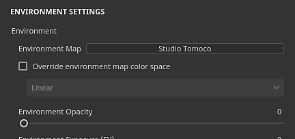

# Configurações do ambiente

Esta seção das **Configurações de Exibição** controla a iluminação no visor.

## Ambiente

| *Configuração* | *Descrição* |
| --- | --- |
| **Mapa do ambiente** | Textura do mapa de ambiente a ser usada para iluminar a cena. Pode ser encontrado na janela [Ativos](../assets/assets.md) usando a predefinição “Ambiente”.Clique no botão para abrir uma miniprateleira e escolher um mapa de ambiente diferente. |
| **Substituir espaço de cores do mapa de ambiente** | Se o projeto atual usar o [Gerenciamento de cores](../../features/color-management/color-management.md), esta configuração poderá ser habilitada para substituir o espaço de cores do mapa de ambiente. |
| **Opacidade do ambiente** | Controla a visibilidade/opacidade das texturas do ambiente no plano de fundo do visor. Essas configurações não têm impacto na iluminação da cena. |
| **Exposição do Ambiente** | O valor de exposição (VE) é um número que representa uma luminância fixa da cena. Essa configuração permite deslocar o valor padrão de luminância.Essa configuração deve permanecer em 0 ao trabalhar com os mapas de ambiente fornecidos com o aplicativo. Texturizar um ativo com um valor de exposição incorreto pode levar a problemas de calibração de cores em outros aplicativos. |
| **Rotação do ambiente** | Controla a rotação horizontal da textura do ambiente. Útil para girar a iluminação na cena e alterar a forma como o objeto reage. Pode ser controlado com um [atalho](../settings/shortcuts.md). |
| **Desfoque de ambiente** | Controla o nível de nitidez ou desfoque que a textura do ambiente terá no plano de fundo da viewport. Essa configuração não afeta a iluminação. |
| **Alinhamento do ambiente** | Controla como a textura do ambiente gira em torno do modo 3D dentro da viewport. Essa configuração pode ser usada para iluminar áreas no modelo 3D quando definida como local.Valores possíveis:<ul data-preserve-html="true"><li data-preserve-html="true"><strong>Mundo</strong> (padrão): o ambiente está alinhado com a cena e gira ao redor do eixo superior do modelo 3D.</li><li data-preserve-html="true"><strong>Local</strong>: o ambiente está alinhado à câmera e gira ao redor do eixo superior da câmera.</li></ul> |

## Sombras

| *Configuração* | *Descrição* |
| --- | --- |
| **Sombras** | Ativar/desativar renderização de sombras no visor. |
| **Modo de computação** | Controla a rapidez com que as sombras são computadas.<ul data-preserve-html="true"><li data-preserve-html="true"><strong> Intensivo </strong>: Calcula rapidamente, mas pode congelar a renderização do visor.</li><li data-preserve-html="true"><strong> Média </strong> : Média do modo Intensivo e Leve.</li><li data-preserve-html="true"><strong> Leve </strong> : (padrão) Calcula lentamente as sombras durante alguns segundos, mas não reduz o desempenho do visor.</li></ul> |
| **Opacidade das sombras** | Controla o quanto de Sombras ficará visível na cena. |
