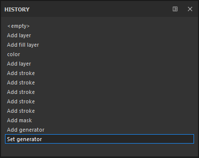

# Histórico

\
A janela Histórico lista todas as ações e modificações feitas no projeto aberto no momento.

* Cada elemento da lista pode ser clicado para voltar ao estado do projeto quando a ação foi criada/aplicada.
* Criar uma nova ação quando não estiver no último elemento da lista apagará as ações futuras existentes e as substituirá por uma nova.
* As ações são globais para o projeto, portanto, criar uma camada em dois conjuntos de texturas diferentes aparecerá na mesma lista.

Embora todas as informações sejam salvas em um projeto (para poder tinta/textura tudo novamente), a lista Histórico não estará acessível se o projeto for fechado e reaberto. A lista de histórico só está disponível durante a sessão atual.
