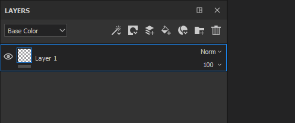
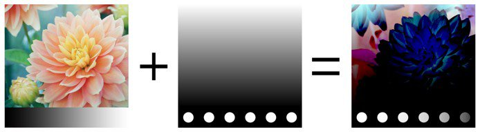
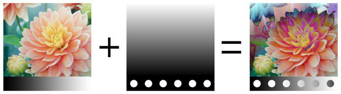
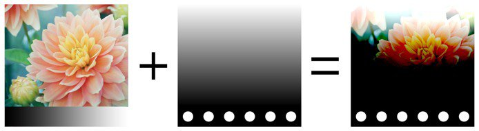
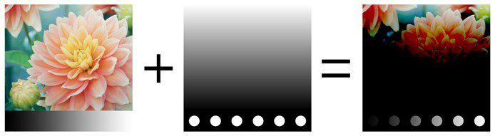
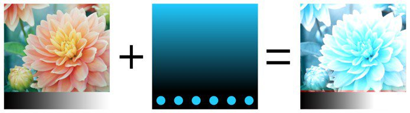
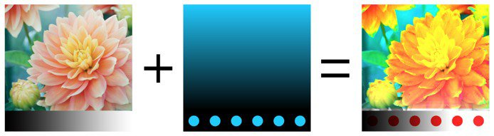

# Modos de mesclagem

Camadas e efeitos têm acesso a muitos **Modos de mesclagem**. Eles permitem misturar o resultado de uma camada com as outras camadas abaixo de maneiras diferentes.

Nem todos os Modos de mesclagem são adequados para todos os casos de uso. Por exemplo, os **Modos de mesclagem do mapa normal** só são úteis para o **canal normal** em um conjunto de texturas.

## Ordem do Modo de Mesclagem

Para entender como e quando um Modo de Mesclagem é aplicado, é importante entender a ordem em que as operações são executadas na **Pilha de Camadas**:

1. A Camada na Parte Inferior é calculada.
1. A Camada na Parte Superior é computada e misturada com a camada abaixo com base no Modo de Mesclagem (exemplo: Multiplicação).
1. A Máscara é aplicada para dar uma aparência final à camada Superior.

## Alterar O Modo De Mesclagem

O Modo de Mesclagem pode ser alterado para **cada canal** em uma camada. Para alternar entre os canais, use o menu suspenso superior esquerdo disponível na janela da pilha de camadas.

Para alterar o modo de mesclagem, basta clicar no menu suspenso Modo de mesclagem em uma camada específica:

>[!NOTE]
>
> É possível alternar rapidamente entre os Modos de mesclagem com os seguintes atalhos se o menu suspenso estiver em foco:
> 
> * Atalhos de teclado de seta para cima ou para baixo
> * Botão de rolagem do mouse para cima ou para baixo

## Lista de modos de mesclagem

Abaixo está a lista de todos os Modos de mesclagem disponíveis nas camadas e efeitos do Substance 3D Painter. A maioria dos Modos de Mesclagem funciona por meio de operações em RGB (ou em Tons de Cinza), mas algumas operações também são executadas por um modo diferente, que é o [HSV (Matiz, Saturação, Valor)](https://en.wikipedia.org/wiki/HSL_and_HSV). Todos os Modos de Mesclagem são executados em **espaço de Gama Linear** internamente.

| *Nome* | *Descrição* |
| --- | --- |
| Normal | Exibe a camada Superior sobre a camada Inferior sem transformação (modo de cópia). Se a camada Superior tiver transparência (alfa), ela exibirá a camada Inferior pelos pixels transparentes. 

 |
| Passagem | Nivela a camada Inferior na camada Superior. Principalmente útil nos seguintes casos:<ul data-preserve-html="true"> <li data-preserve-html="true">Para aplicar um efeito em todas as camadas abaixo da camada Superior</li> <li data-preserve-html="true">Para borrar ou clonar as camadas abaixo da camada superior</li> </ul> 

 **Observação:** os **Efeitos** podem ser **arrastados e soltos** diretamente na pilha de camadas. Isso criará uma camada com o Modo de Mesclagem definido como PassThrough para todos os seus canais. |
| Desativar | Descarta a mesclagem da camada, exibindo apenas as camadas anteriores. Ele pode ser usado para otimizar o cálculo de um canal ignorando-o na camada Superior. 

 |
| Substituir | Substitui a camada Inferior. Isso é útil, por exemplo, para evitar a mesclagem de informações com as camadas abaixo. Substituir funciona de maneira diferente da mesclagem Normal, pois isso também ignorará o alfa presente na camada Superior, que pode resultar em pixels transparentes. 

 |
|  |  |
| Multiplicar | Multiplica a camada Superior pela camada Inferior. O resultado será sempre uma cor mais escura. 

 |
| Dividir | Divide as camadas abaixo pelas informações de cor da camada atual. A imagem resultante fica na maior parte do tempo mais clara e, às vezes, pode parecer apagada. 

 |
| Divisão inversa | Idêntico ao modo de mistura Dividir, mas as camadas Superior e Inferior são trocadas na operação de mistura. 

 |
| Escurecer (min) | Mantém o valor mínimo de cor entre as camadas Superior e Inferior. 

 |
| Clarear (Máx.) | Mantém o valor máximo de cor entre as camadas Superior e Inferior. 

 |
|  |  |
| Subexposição linear (adicionar) | Adiciona o valor de cor da camada superior à camada inferior. O resultado pode fornecer cores que estão abaixo de 0 ou acima de 1, caso em que o resultado será apertado/cortado se o canal não for HDR. Esse Modo de mesclagem é útil para acumular informações do height, por exemplo. 

 |
| Subtrair | Subtrai a Cor da camada superior da camada inferior. O resultado pode fornecer cores abaixo de 0, caso em que o resultado será apertado/cortado se o canal não for HDR. 

 |
| Inverter subtração | Idêntico ao Modo de mesclagem Subtrair, mas as camadas Superior e Inferior são trocadas na operação de mesclagem. 

 |
| Diferença | Subtrai a Cor da camada superior da Camada inferior, mas assume o valor absoluto do resultado (valores negativos se tornarão positivos). 

 |
| Exclusão | Semelhante ao modo de mesclagem Diferença, mas produzirá um resultado com um contraste menor. 

 |
| Adição Assinada (AddSub) | Ambas as opções adiciona e subtrai informações de cores da camada Inferior com base nas cores da camada Superior. Os valores de tons de cinza não têm efeito, enquanto as cores mais escuras subtraem informações e as cores mais claras adicionam informações. 

 |
|  |  |
| Sobrepor | Combine os modos de mesclagem Tela e Multiplicar. Os valores de tons de cinza na camada Superior não terão efeito, mas as cores escuras multiplicarão as cores, enquanto as cores brilhantes clarearão as cores. 

 |
| Divisão | As informações de cores das camadas Superior e Inferior são invertidas e, em seguida, multiplicadas umas contra as outras. Em seguida, esse resultado é invertido novamente. Isso produz um resultado visual que é o oposto do modo de mesclagem Multiplicar e fornece uma imagem mais brilhante. 

 |
| Superexposição linear | Adiciona as informações de Cor das camadas superior e inferior e, em seguida, subtrai 1 do resultado. 

 |
| Superexposição de cor | Divide a camada Inferior pela camada Superior. A camada Inferior é invertida antes de a operação ser executada. Essa operação de mesclagem escurece a camada Superior e aumenta o contraste para mostrar as cores dessa camada. Quanto mais escura for a camada Inferior, mais cor será usada. 

 |
| Subexposição de cor | Divide a Camada inferior pela camada superior invertida. Essa operação clareia a camada Inferior dependendo do valor da camada Superior. Quanto mais brilhante for a camada Superior, mais suas cores afetam a camada Inferior. 

 |
|  |  |
| Luz indireta | Semelhante ao Modo de mesclagem de sobreposição, mas aplicado com uma curva diferente para mesclar as informações de Cor que resultam em uma imagem menos contrastada. 

 |
| Luz direta | Semelhante ao Modo de mesclagem de sobreposição (combine as operações Multiplicar e Tela). A diferença é que a ordem de operação é invertida, o que resulta em uma imagem com cores mais escuras ou mais claras, mas com menos contraste. 

 |
| Luz brilhante | Combina os modos de mesclagem Subexposição de Cor e Superexposição de Cor. A subexposição é aplicada a cores mais claras que o cinza e a superexposição é aplicada a cores mais escuras que o cinza. Os valores de cinza não são afetados. O resultado é uma imagem mais contrastada. 

 |
| Luz linear | Combina Subexposição linear e Superexposição linear. A subexposição é aplicada a cores mais claras que o cinza e a superexposição é aplicada a cores mais escuras que o cinza. Os valores de cinza não são afetados. O resultado é semelhante à Luz vívida, mas com menos contraste. 

 |
| Luz do marcador | Clareia e escurece informações de cores com base nas cores da camada superior. Se as cores escuras na camada Superior forem mais escuras do que as cores na camada Inferior, elas ficarão visíveis. Se não forem, elas desaparecerão. O mesmo princípio se aplica a cores brilhantes. Esse modo de mesclagem pode resultar em correções ou manchas (ruído grande) e remove completamente todos os tons médios. 

 |
|  |  |
| Tonalidade | Executa a operação com o modelo HSV. Mantém apenas o matiz da camada superior e usa a saturação e o valor da camada inferior. As cores pretas e muito escuras não têm nenhum matiz, portanto as cores da camada inferior permanecerão inalteradas. 

 |
| Saturação | Executa a operação com o modelo HSV. Mantém apenas a saturação da camada superior e usa o matiz e o valor da camada inferior. As cores pretas e muito escuras ficam dessaturadas, portanto as cores da camada Inferior se tornarão valores em tons de cinza. 

 |
| Cor | Executa a operação com o modelo HSV. Mantém apenas o matiz e a saturação da camada superior e usa o valor da camada inferior. As cores pretas e muito escuras não têm nenhum matiz e ficam sem saturação, portanto, as cores da camada Inferior se tornarão valores de tons de cinza. 

 |
| Valor | Executa a operação com o modelo HSV. Mantém apenas o valor da camada superior e usa o matiz e a saturação da camada inferior. 

 |
|  |  |
| Combinação de Mapa Normal | Operação de Mesclagem de Whiteout. Preserve detalhes enquanto garante que os normais planos ainda operem corretamente. Consulte [Pintura Normal de Mapa](../../painting/advanced-channel-painting/normal-map-painting.md) para obter mais informações. 

 |
| Detalhe do Mapa Normal | Operação de mesclagem orientada por detalhes (mapeamento normal reorientado), mais precisa do que a combinação normal de mapas. Preserve mapas normais planos e a intensidade das duas fontes. Para garantir que o resultado, a camada superior normal seja reorientada para seguir a superfície da camada inferior. Consulte [Pintura Normal de Mapa](../../painting/advanced-channel-painting/normal-map-painting.md) para obter mais informações. 

 |
| Detalhe Inverso do Mapa Normal | Mesmo comportamento da operação de mesclagem Detalhes do mapa normal, mas é a camada inferior que é transformada para se ajustar à superfície da camada superior. Consulte [Pintura Normal de Mapa](../../painting/advanced-channel-painting/normal-map-painting.md) para obter mais informações. 

 |

>>
