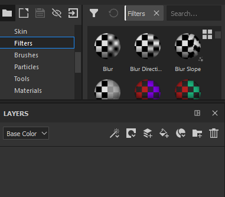

# Criação de camadas

Há várias maneiras de adicionar/criar camadas na pilha de camadas:

| *Ação* | *Demonstração* |
| --- | --- |
| Crie uma **camada de pintura** clicando no botão dedicado 

 | 

 |
| Crie uma **camada de preenchimento** clicando no botão dedicado 

 | 

 |
| Crie uma **pasta** clicando no botão dedicado 

 | 

 |
| **Duplique** uma camada usando um dos seguintes métodos:<ul data-preserve-html="true"><li data-preserve-html="true">Clique com o botão direito do mouse > Duplicar</li><li data-preserve-html="true">Atalho CTRL+D ou COMMAND+D</li><li data-preserve-html="true">Pressione e mantenha CTRL ou COMMAND e arraste e solte a(s) camada(s)</li></ul> | 

 |
| Excluir uma camada clicando no botão dedicado 

 | 

 |

>[!NOTE]
>
> Algumas dessas ações têm um atalho de teclado associado que pode ser consultado na [página dedicada](../settings/shortcuts.md).

Arrastar e soltar recursos da prateleira também pode ser uma maneira de criar camadas:

| *Ação* | *Demonstração* |
| --- | --- |
| Arraste e solte um **Material** de [Ativos](../assets/assets.md) na pilha de camadas | 

 |
| Arraste e solte um **Material inteligente** dos [Ativos](../assets/assets.md) na pilha de camadas | 

 |
| Arraste e solte **Efeitos** dos [Ativos](../assets/assets.md) na Pilha de Camadas | 

 |
