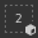
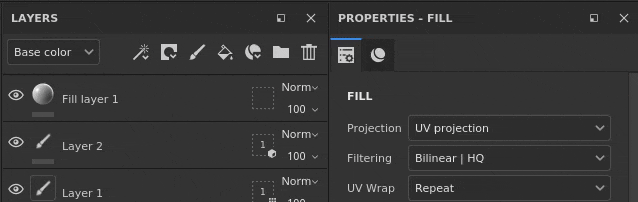
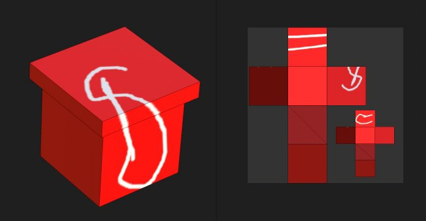
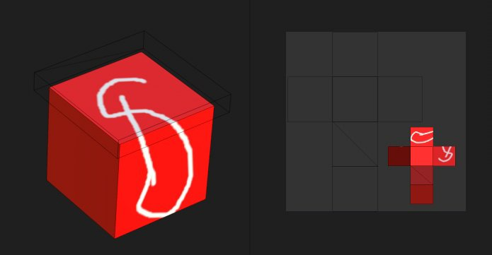

# Máscara de geometria

\
A máscara de geometria é uma máscara secundária em camadas que permite mascarar uma camada com base na geometria do modelo 3D do conjunto de texturas associado. Ele pode mascarar por nomes de malha ou por blocos UV.

## Visão geral

A máscara de geometria funciona especificando em qual parte do modelo 3D a camada deve ser aplicada por meio de uma lista de inclusão/exclusão.

A Máscara de geometria é uma ferramenta útil para descartar rapidamente uma grande parte da geometria do modelo 3D. Ela oferece várias vantagens à máscara de pintura:

* Geralmente, é mais rápido configurar e usar com modos de seleção de viewport.
* Ele oferece melhores desempenhos, pois a geometria pode ser completamente descartada ao gerar as texturas.
* Ele não é destrutivo e será atualizado quando o modelo 3D for alterado após uma reimportação.
* Permite pintar a geometria abaixo da geometria mascarada, permitindo pintar partes ocultas.
* Como uma máscara de pintura, a máscara de geometria pode ser aplicada em um grupo para afetar várias camadas de uma vez.

### Estados do ícone

O ícone da máscara de geometria pode indicar em que estado está:

| Ícone | Descrição |
| --- | --- |
| 

 | Nenhuma geometria foi excluída, a camada é aplicada em toda a malha do Conjunto de textura associado. Esse é o estado padrão de qualquer nova camada ou pasta. |
| 

 | Um ou mais nomes de malha foram excluídos. A numeração indica a quantidade de elementos restantes que ainda são afetados pela camada. |
| 

 | Um ou mais Blocos UV foram excluídos. A numeração indica a quantidade de elementos restantes que ainda são afetados pela camada. |
| 

 | Nenhum nome de malha é incluído, a camada não terá nenhum efeito real. |

## Edição da máscara de Geometria

Para modificar a máscara de Geometria de uma determinada camada, basta clicar no ícone dedicado. Para sair do modo de edição, basta clicar em outra parte da camada, como o conteúdo ou a máscara de pintura:

### Tipos de mascaramento

A máscara de geometria é compatível com dois tipos de mascaramento:

| Tipo | Descrição |
| --- | --- |
| **Blocos UV** | O mascaramento é feito especificando qual número de UV Tile (UDIM) deve ser incluído. Este é o método mais eficiente que permite descartar completamente uma textura de ser computada. |
| **Nomes de malha** | O mascaramento é feito especificando qual sub-malha deve ser incluída no modelo 3D. A geometria é agrupada pelo nome da malha. |

### Ações de pilha de camadas

O estado da máscara de geometria pode ser modificado rapidamente na pilha de camadas diretamente clicando com o botão direito do mouse no ícone.

Ela oferece as seguintes ações:

| Ação | Descrição |
| --- | --- |
| **Copiar máscara de geometria** | Copie o tipo e a seleção da máscara de Geometria da camada fornecida. |
| **Colar na máscara de geometria.** | Cole as propriedades da máscara de Geometria copiadas anteriormente. |
| **Incluir tudo** | Marca todos os elementos da máscara fornecida como selecionados. |
| **Excluir tudo** | Marca todos os elementos da máscara fornecida como desmarcados. |

## Pintura através de geometria mascarada

Quando partes da geometria forem excluídas, elas podem ser ocultadas na viewport. Isso permite pintar sobre a geometria que antes estava por baixo e inacessível.

Para ocultar a geometria excluída, use o botão na parte superior da viewport na barra de ferramentas contextual:

No exemplo abaixo, o modelo 3D foi dividido em dois objetos: uma parte superior e outra inferior. Por padrão, os traçados de pincel colidem com todos os objetos. excluindo a parte superior, é agora possível pintar apenas a parte inferior.

>[!NOTE]
>
> A lista de inclusão/exclusão da máscara de geometria é dinâmica, a alteração de seu estado acionará um novo cálculo dos traçados de pincel na camada. Isso permite ajustar o mascaramento sem perder os traçados do pincel ao reimportar uma malha com novos blocos UV ou se os nomes da malha tiverem sido alterados. No entanto, isso também significa que os traçados de pincel não são cozidos, portanto, qualquer alteração na máscara de geometria pode levar a uma projeção incorreta do pincel posteriormente.

| Visual | Descrição |
| --- | --- |
| 

 | Nenhuma geometria foi excluída na máscara de geometria. A camada de pintura na qual o traçado de pincel branco foi feito colide com toda a geometria.O botão **Ocultar geometria excluída** está desabilitado. |
| 

 | A parte superior foi excluída da máscara de geometria, e o traçado do pincel branco colide apenas com a parte inferior da geometria.O botão **Ocultar geometria excluída** está habilitado. |
| 

 | A parte superior foi excluída da máscara de geometria, e o traçado do pincel branco colide apenas com a parte inferior da geometria.O botão **Ocultar geometria excluída** está desabilitado. |
