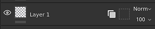
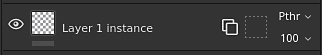
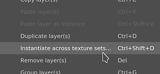
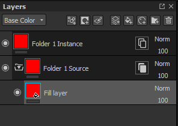

# Instância de camada

A **Instância de camada** permite sincronizar parâmetros de camada em várias camadas e em [Conjuntos de Texturas](../texture-set/texture-set.md), ao mesmo tempo em que ainda é possível gerar um resultado dependente de malha.

Quando uma instância de camada é criada, a camada original (ou camada de origem) é usada para replicar parâmetros em todas as instâncias existentes. **Somente a camada de origem pode ser modificada**.

>[!WARNING]
>
> Todas as ações de pintura (traçados de pincel, preenchimento de polígono etc.) só funcionará no conjunto de texturas em que a camada de origem está localizada. Outros conjuntos de texturas que tenham uma instância dessa camada simplesmente descartarão as ações de pintura.

## Criação de uma ocorrência de camada

Para criar uma ocorrência de camada:

1. Selecionar qualquer camada existente
1. Copiar a camada (**CTRL+C**)
1. Cole-o como uma instância (use **CTRL+SHIFT+V** ou clique com o botão direito do mouse para abrir o menu de contexto e escolha **Colar como instância**)

>[!NOTE]
>
> Instâncias podem ser criadas de qualquer camada, incluindo **grupos**. Criar instâncias de uma pasta pode ser uma maneira fácil de replicar várias camadas em vários conjuntos de texturas. A adição de camadas dentro de uma pasta de instâncias também as replicará em instâncias existentes.

Depois que uma ocorrência é criada, as camadas de origem e de destino exibem um novo ícone. Esse ícone é um botão que pode ser usado para navegar entre uma camada de origem e suas instâncias com mais facilidade, sem precisar alternar manualmente entre Conjuntos de texturas (veja abaixo).

| Nome | Ícone |
| --- | --- |
| **Camada sem instância** | 

 |
| **Origem da Instância** | 

 |
| **Destino da Instância** | 

 |

## Criação de uma instância em Conjuntos de texturas

É possível criar uma instância de camada em vários Conjuntos de texturas em uma ação, evitando copiá-la/colá-la manualmente.

Para criar uma instância em vários Conjuntos de texturas:

1. Selecionar qualquer camada existente
1. Clique com o botão direito na camada para abrir o menu de contexto
1. Escolha **Instanciar entre conjuntos de texturas**
1. Na nova janela, verifique quais Conjuntos de texturas precisam receber uma instância.
1. Clique em OK para validar e criar as instâncias.

<table>
<tr style="border: 0;">
<td style="border: 0;" valign="top">

</td>
<td style="border: 0;" valign="top">

</td>
</tr>
</table>

>[!NOTE]
>
> O ponto de exclamação ao lado do nome de um Conjunto de Texturas indica uma incompatibilidade de canal **&#x200B;**. Isso significa que, se uma instância for criada nesses Conjuntos de texturas, ela não será renderizada corretamente, pois um canal está ausente.

## Alternar entre uma instância e sua origem

Como uma instância pode **somente** ser atualizada por **edição da origem** (por motivos técnicos), é obrigatório selecionar a camada de origem para editar suas propriedades.\
Isso pode ser feito clicando no **botão de propriedades da instância** na camada da pilha de camadas.

Ao clicar em um botão de propriedades da instância, ele alternará a **janela de propriedades** da ferramenta/camada atual para **uma lista** exibindo uma camada de origem e suas instâncias.\
Clicando em **qualquer elemento** da lista para **ir automaticamente para esta camada** . Isso também **alterará** automaticamente os **conjuntos de texturas selecionados** para a direita.

Usar a lista de **árvores de instâncias** é a melhor maneira de **passar rapidamente** de uma instância para sua origem ao ver as **dependências** ao mesmo tempo.

## Ciclos de instância (e como resolvê-los)

Ciclos são ocorrências usadas na própria camada de origem, direta ou indiretamente. Os ciclos **não podem ser computados** pelo mecanismo do Substance 3D Painter e, portanto, precisam ser **desabilitados** até que sejam corrigidos ou removidos.

Exemplo:\

Neste exemplo, a ocorrência da camada de origem é movida dentro dela (porque é uma pasta). A instância é interrompida porque, para gerar seus parâmetros, precisamos consultar os parâmetros da origem, que depende dos parâmetros da instância. Isto cria um ciclo que não pode ser resolvido automaticamente. A instância é desativada.

A única maneira de corrigir um ciclo é **mover** a instância para fora da pasta ou **excluí-la**.

As instâncias de camada podem ser usadas em camadas de origem, desde que a própria instância se refira a uma camada de origem diferente.
