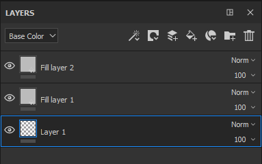
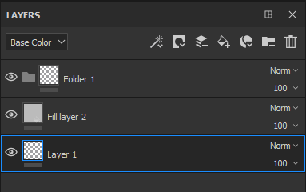
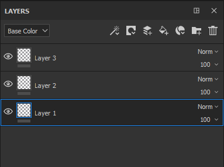

# Gerenciamento de camadas

Aqui estão as possíveis manipulações dentro da pilha de camadas:

| *Ação* | *Demonstração* |
| --- | --- |
| Clique e arraste para mover uma camada. Ao mover uma camada, uma barra pode ser visível, indicando onde a camada será colocada:<ul data-preserve-html="true"><li data-preserve-html="true"><strong>Barra acima de uma camada</strong> : a camada será colocada acima da camada</li><li data-preserve-html="true"><strong>Barra entre duas camadas</strong> : a camada será colocada entre as duas camadas</li><li data-preserve-html="true"><strong>Barra abaixo de uma camada</strong> : a camada será colocada abaixo da camada</li></ul> | 

 |
| **Mover para uma pasta**: clique e solte uma camada sobre uma pasta para colocá-la dentro dela | 

 |
| **Várias seleções** : pode ser feito de duas maneiras diferentes:<ul data-preserve-html="true"><li data-preserve-html="true">Pressione e mantenha a tecla Ctrl ou Command</li><li data-preserve-html="true">Pressione a tecla Shift enquanto clica na primeira e na última camada</li></ul> | 

 |
| **Agrupando camadas** : uma pasta pode ser criada com a camada atualmente selecionada por uma das seguintes ações:<ul data-preserve-html="true"><li data-preserve-html="true">Clique com o botão direito do mouse > Agrupar camadas</li><li data-preserve-html="true">Pressionar Ctrl+G ou Command+G</li></ul> | 

 |
