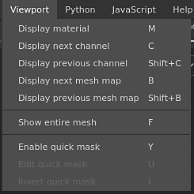

# Menu Visor

O menu viewport pode ser usado para alterar o modo de exibição de [Viewports](https://substance3d.adobe.com/).

| Ação | Descrição |
| --- | --- |
| **Exibir material** | Alterne as viewports para o modo **Material**, que mostra o modelo 3D com iluminação e sombreamento. |
| **Exibir próximo canal** | Alterne as viewports para o modo solo para exibir o próximo canal do Conjunto de texturas. |
| **Exibir canal anterior** | Alterne as viewports para o modo solo para exibir o canal anterior do Conjunto de texturas. |
| **Exibir próximo mapa de malha** | Alterne as viewports para o modo solo para exibir o próximo tipo de mapa de malha feito bake. |
| **Exibir mapa de malha anterior** | Alterne as viewports para o modo solo para exibir o tipo anterior de mapa de malha feito bake. |
| **Mostrar toda a malha** | Ajuste a câmera do visor para centralizá-lo no modelo 3D. |
| **máscara rápida Habilitada** | Consulte a página [Máscara rápida](../../painting/tool-list/quick-mask.md) para obter mais informações. |
| **Editar máscara rápida** | Consulte a página [Máscara rápida](../../painting/tool-list/quick-mask.md) para obter mais informações. |
| **Inverter máscara rápida** | Consulte a página [Máscara rápida](../../painting/tool-list/quick-mask.md) para obter mais informações. |

Para obter mais informações sobre os modos de exibição, consulte [Configurações de exibição](../display-settings/display-settings.md).

Para obter mais informações sobre a Máscara rápida, consulte a [página dedicada](../../painting/tool-list/quick-mask.md).
