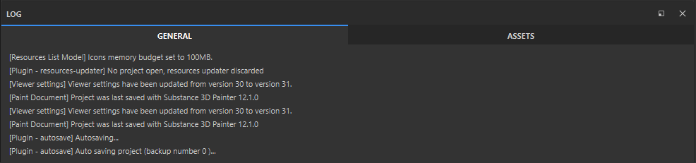

# Log

O log é onde o Substance 3D Painter e os [Plug-ins](../../features/plugins/plugins.md) podem exibir atualizações de status, mantendo o controle do progresso, dos avisos e dos erros.

O registro é dividido em duas abas.

* A **guia Geral** mostra informações relacionadas ao projeto e à cena, incluindo detalhes de exportação.
* A **guia Ativos** mostra erros e logs relacionados especificamente ao **painel Ativos**.
