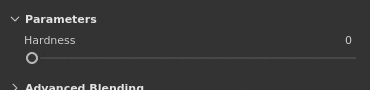

# Controles deslizantes

Esta página mostra como usar os controles deslizantes na interface do aplicativo.

| Ação | Exemplo | Descrição |
| --- | --- | --- |
| **Arrastar** | 

 | Clique e arraste ao passar o mouse sobre um controle deslizante para alterar seu valor. |
| **Arrastar com precisão** | 

 | Pressione e mantenha a tecla Shift pressionada no teclado enquanto clica para aumentar a distância de arrastar do controle deslizante. Esse atalho permite ajustar com mais precisão o controle deslizante ao arrastá-lo. |
| **Saltar** | 

 | Clique em qualquer lugar em um controle deslizante para saltar para o valor na posição do mouse. |
| **Para Cima/Para Baixo** | 

 | Depois de obter o foco de um controle deslizante clicando nele, use as teclas de seta para cima e para baixo no teclado para aumentar ou diminuir o valor, passo a passo. |
| **Edição de valor** | 

 | Clique no campo de texto acima de um controle deslizante para editar manualmente o valor por meio do teclado. |
