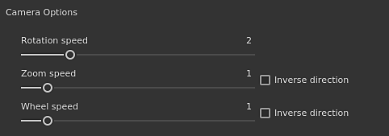

# Preferências gerais

Esta página explica as principais configurações do aplicativo.

## Opções de interface

| Configuração | Descrição |
| --- | --- |
| **Idioma** | Defina o idioma usado pela interface no aplicativo. Esta configuração requer uma reinicialização do aplicativo para entrar em vigor.Valores possíveis:<ul data-preserve-html="true"><li data-preserve-html="true"><strong>Padrão (idioma do sistema)</strong>: recuperar o idioma compatível do sistema operacional</li><li data-preserve-html="true"><strong>Inglês</strong></li><li data-preserve-html="true"><strong>Alemão</strong></li><li data-preserve-html="true"><strong>Francês</strong></li><li data-preserve-html="true"><strong>Japonês</strong></li><li data-preserve-html="true"><strong>Chinês</strong> (simplificado)</li></ul> |
| **Mostrar auxiliar de teclado** | Se habilitada, exibe os atalhos de teclado no canto inferior esquerdo das viewports ao pressionar uma tecla (como CTRL ou SHIFT). |
| **Mostrar eixos mundiais** | Se ativada, mostra o eixo do mundo na parte inferior direita da exibição 3D. |
| **Cor do plano de fundo** | Escolhe as cores usadas como plano de fundo para as viewports. Duas cores estão disponíveis para criar um degradê. |
| **Exibir somente o material selecionado ao pintar** | Se esta opção estiver ativada, somente o Conjunto de texturas atualmente selecionado será exibido na visualização 3D ao pintar (ocultando temporariamente os outros Conjuntos de texturas).  **Observação:** é recomendável manter esta configuração desativada, pois alterar rapidamente a visibilidade na viewport pode afetar o desempenho das [Texturas Virtuais Esparsas](../../features/sparse-virtual-textures.md). |
| **Dimensionamento do Visor** | Permite reduzir a resolução da viewport para telas HDPI/Retina para melhorar o desempenho.Valor possível:<ul data-preserve-html="true"><li data-preserve-html="true"><strong>Nenhum</strong>: sem dimensionamento, o visor é renderizado na resolução de tela nativa.</li><li data-preserve-html="true"><strong>Automático</strong>: divide a resolução da tela por duas (somente em telas HDPI).</li></ul> |

## Opções de pilha de camadas

| Configuração | Descrição |
| --- | --- |
| **Escala UV padrão de materiais** | Define o valor padrão de divisão em blocos gráficos/repetição para camadas de preenchimento e o efeito de preenchimento na pilha de camadas ao aplicar materiais. |
| **Usar miniaturas simplificadas** | Se ativada, a pilha de camadas exibirá apenas ícones em vez de miniaturas. Usar ícones melhora o desempenho. Esta configuração não se aplica a projetos que usam o fluxo de trabalho Bloco UV, pois eles sempre exibirão ícones. |

## Opções de câmera

| Configuração | Descrição |
| --- | --- |
| **Velocidade de rotação** | Multiplicador da velocidade de rotação padrão da câmera nas viewports. |
| **Velocidade do zoom** | Multiplicador da velocidade de zoom padrão da câmera nas viewports.A direção inversa permite inverter a direção do zoom com base no movimento do mouse. |
| **Velocidade da roda** | Multiplicador da velocidade de zoom da roda do mouse.A direção inversa permite inverter a direção do zoom com base no movimento da roda. |

## Opções de cozedura

| Configuração | Descrição |
| --- | --- |
| **Salvar arquivos de cena pré-processados** | Se ativada, as malhas de alta polietileno pré-processadas usadas pelos padeiros serão salvas em disco para futura reutilização. Essa configuração permite reprogramar mais rapidamente. |
| **Habilitar processo de preparação de visualização ao vivo** | Se ativadas, as portas de visualização 3D e 2D exibirão a textura atual do padeiro sendo computada na malha. |
| **Habilitar Rastreamento de raios do GPU** | Se ativada, os padeiros tentarão usar a GPU para executar o rastreamento de raios em vez da CPU. O recurso permite que os padeiros tenham um desempenho mais rápido em geral.Isso só pode ser ativado em hardware compatível. Consulte os [Requisitos de sistema](../../getting-started/system-requirements.md) para obter mais detalhes. |

## Opções de visualização

| Configuração | Descrição |
| --- | --- |
| **Diretório de cache local** | Defina o local secundário para onde as miniaturas de recursos estão localizadas quando geradas.Essa configuração é útil para calcular e armazenar miniaturas de recursos quando um caminho de recurso é somente leitura (como em um caminho de rede com acesso somente leitura). Isso evita recalcular as miniaturas em cada inicialização porque, do contrário, elas não seriam salvas em disco. |
| **Orçamento do cache local (em MB)** | Defina o tamanho máximo do cache local. |
| **Sombreamento de visualização do material** | Definir um sombreador a ser usado para gerar miniaturas de materiais em prateleiras. Isso é útil se os recursos usarem um fluxo de trabalho diferente do sombreador padrão. Esta configuração requer que o aplicativo seja reiniciado para que tenha efeito. |

## Arquivos temporários

| Configuração | Descrição |
| --- | --- |
| **Diretório de cache** | Define o local em que os arquivos temporários são gravados. Isso inclui o cache de [Texturas Virtuais Esparsas](../../features/sparse-virtual-textures.md). Esta configuração pode ser substituída por [Variáveis de ambiente](../../pipeline-and-integration/configuration/environment-variables.md). |

## Texturas virtuais esparsas

| Configuração | Descrição |
| --- | --- |
| **Aceleração do suporte de hardware** | Se ativado, o aplicativo tentará usar as texturas esparsas com a GPU. Para obter mais detalhes, consulte a página [Texturas virtuais esparsas](../../features/sparse-virtual-textures.md). Esta configuração pode ser substituída por [Variáveis de ambiente](../../pipeline-and-integration/configuration/environment-variables.md). |

## Hardware de Iray

Esta seção lista todos os hardwares compatíveis disponíveis que podem ser usados ao renderizar com o Iray.

A configuração da CPU está disponível em todos os computadores. Se o computador tiver uma **GPU Nvidia** com uma versão de CUDA compatível, ela também será listada aqui.

>[!NOTE]
>
> É recomendável desativar a CPU e manter apenas o hardware de GPU ativado para garantir o melhor desempenho de renderização. Ter a CPU e a GPU ativadas juntas pode aumentar o tempo de renderização.

## Privacidade

| Configuração | Descrição |
| --- | --- |
| **Enviar estatísticas de uso automaticamente** | Se ativado, envia informações anonimamente sobre a configuração de hardware do computador, juntamente com outros dados de uso. Esses dados nos ajudam a desenvolver e aprimorar o software. |
