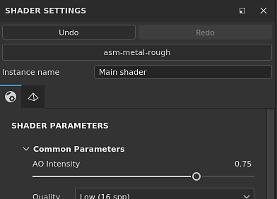
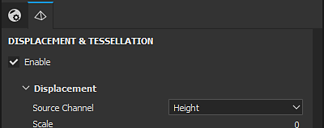

# Configurações do sombreamento

A janela **Configurações de sombreadores** permite controlar os parâmetros de sombreador (e Iray mdl) e de deslocamento de geometria.

Um sombreador é uma função que define como um objeto deve ficar ao interagir com iluminação e sombras nas viewports. Nesse aplicativo, os sombreadores são usados para saber como ler os canais do conjunto de texturas e renderizar a malha 3D nas viewports.

## Desfazer pilha e arquivo de sombreador

Esta seção da janela Configurações do sombreador controla os parâmetros principais ao manipular sombreadores.\
A pilha Desfazer/Refazer do sombreador é independente do [Histórico](https://substance3d.adobe.com/display/DRAFTPAINTER/History) principal para não criar conflitos ao pintar.

Se o arquivo de sombreador estiver marcado como “Desatualizado”, é recomendável atualizá-lo quando possível. Consulte: [Atualizando um Sombreador](https://substance3d.adobe.com/display/DRAFTPAINTER/Updating+a+Shader)

| *Configuração* | *Descrição* |
| --- | --- |
| **Desfazer** | Reverter/Cancelar uma alteração do arquivo de sombreador ou qualquer modificação de parâmetros de sombreador |
| **Refazer** | Aplique novamente uma alteração que foi cancelada através da opção Desfazer. |
| **Arquivo de sombreador** | Botão mostrando o arquivo de sombreador atual usado. Clique no botão para abrir uma miniprateleira e escolher um sombreador diferente. |
| **Nome da instância** | Nome da instância do sombreador. |
| **Restaurar padrões** | Restaure todos os parâmetros de sombreador para seus valores padrão (como estão no arquivo de sombreador). |

### Instância do sombreador

Uma Instância de sombreador é um sombreador baseado em um arquivo de sombreador original, mas com parâmetros personalizados. Uma ocorrência de sombreador pode ser compartilhada entre conjuntos de texturas, e um conjunto de texturas pode ter uma ocorrência de sombreador exclusiva.

**Por exemplo:** um projeto pode usar um sombreador de base, enquanto um conjunto de texturas usa um sombreador personalizado para dar suporte à opacidade.

Para criar e gerenciar Instâncias do Sombreador, consulte a janela [Lista do Conjunto de Texturas](../texture-set/texture-set-list.md).

## Parâmetros do sombreador

Os parâmetros de sombreador dependem do arquivo de sombreador carregado no momento.

## Deslocamento e mosaico

Deslocamento e Mosaico são duas funcionalidades que podem ser usadas para modificar a forma de um objeto para adicionar mais detalhes.

* **Deslocamento**: empurra ou desloca a geometria com base em um canal de entrada.
* **Mosaico**: subdivida a geometria para densificá-la. Mais densidade significa que o espaçamento entre os polígonos é mais curto, o que fornece detalhes mais finos.

Um filtro chamado “**Height para Normal**” está disponível na Prateleira e pode ser usado para obter o mapa normal final (caso a conversão nativa não seja forte o suficiente).

### Deslocamento

Abaixo estão as configurações do Deslocamento:

| *Configuração* | *Descrição* |
| --- | --- |
| <b> Canal de Origem </b> | Canal no qual a deformação da malha se baseia. O padrão é Height, mas também pode ser definido como Deslocamento. |
| <b>Unidade de escala</b> | Selecione como a escala do deslocamento é definida:<ul data-preserve-html="true"> <li data-preserve-html="true"><b>Normalizado: a escala de </b>Deslocamento é relativa ao tamanho da caixa delimitadora da malha.</li> <li data-preserve-html="true"><b>Cena: a escala de </b>Deslocamento é relativa às unidades do arquivo de cena importado.</li> <li data-preserve-html="true"><b>Tamanho físico (cm)</b>: a escala do Deslocamento é medida em cm com base no tamanho físico do objeto.</li> </ul> |
| <b> Valor da escala</b> | Controla a intensidade de deformação aplicada à malha no projeto com base na unidade de Escala selecionada. |

>[!NOTE]
>
> As configurações da unidade de escala da <b>Cena</b> e do <b>Tamanho físico (cm) </b> exigem que o modelo importado tenha sido preparado para medidas de tamanho físico. Se as unidades não estiverem configuradas corretamente no arquivo importado, ou se as unidades de tamanho físico não forem compatíveis com o tipo de arquivo importado, o deslocamento ainda funcionará, mas talvez não forneça resultados precisos para suas necessidades.

### Tesselação

Abaixo estão as configurações de mosaico:

| *Configuração* | *Descrição* |
| --- | --- |
| **Modo de Subdivisão** | Determina como o valor de subdivisão é calculado. As configurações disponíveis são:<ul data-preserve-html="true"><li data-preserve-html="true"> Uniforme (padrão) </li><li data-preserve-html="true"> Comprimento da aresta </li></ul> |
| **Contagem de Subdivisões** | (Modo Uniforme)De 1 a 32. Um valor alto produz mais polígonos, fornecendo mais detalhes, mas podendo apresentar problemas de desempenho. |
| **Comprimento Máximo** | (Mode Edge Length)1 / Valor. Cada borda do polígono é dividida até que cada segmento seja igual ou menor que esse número, sendo 1/1 o tamanho da cena. |
