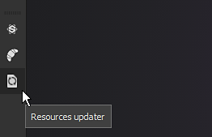

# Atualização de um sombreador

Às vezes, pode ser necessário atualizar o sombreador usado por um projeto para corrigir problemas ou aproveitar os recursos mais recentes. Esta página descreve como fazer isso.

Veja abaixo o método passo a passo para atualizar o sombreador de um projeto:

* **Atualizar um Sombreador por meio da Janela do Sombreador**
* **Atualizar um Sombreador por meio do plug-in Atualizador de Recursos**

Se um projeto usa um **sombreador personalizado** (não enviado por padrão com o Substance 3D Painter), consulte a página [Sombreador personalizado](https://substance3d.adobe.com/display/DRAFTPAINTER/Shader+API) para obter um guia sobre como atualizá-lo.

## Atualizar um sombreador por meio da janela sombreador

### 1 - Abrir a janela Configurações do sombreador

A janela **Configurações do sombreador** está disponível à direita por padrão na barra de ferramentas Dock.

### 2 - Clique no botão do sombreador e selecione o sombreador atualizado

Clique no botão do sombreador (abaixo do botão Desfazer/Refazer) e localize o sombreador que corresponde ao que já foi usado.

### 3 - O sombreador foi atualizado

Depois que o novo sombreador for carregado, a menção **desatualizado** deverá ser removida e o modelo 3D deverá aparecer normalmente na viewport.

## Atualizar um sombreador por meio do plug-in atualizador de recursos

### 1 - Abrir o atualizador de recursos

Vá para a esquerda da interface para encontrar a **barra de ferramentas Plug-ins** e clique no ícone do **Atualizador de Recursos**.

### 2 - Alternar para a guia Sombreador

Na nova janela exibida, clique na guia “Shader” para exibir o sombreador presente no projeto atual.

### 3 - Localizar e atualizar o sombreador

Na guia Shader deve aparecer uma lista de todos os recursos do Shader usados pelo projeto atual. Os sombreadores **desatualizados** estão visíveis com um **plano de fundo vermelho**. Clique no botão “atualizar” ao lado de um recurso para atualizá-lo.

