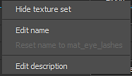

# Lista do conjunto de texturas

A janela **Lista de Conjuntos de Texturas** mostra todas as IDs de material do modelo 3D atual em um projeto. Ele permite alternar e ver a pilha de camadas associada a cada material no modelo, bem como suas configurações dedicadas.

O objetivo principal da janela Lista de conjuntos de texturas é permitir que o alterne de um material para outro para acessar a pilha de camadas associada a cada material.\
No caso do fluxo de trabalho de [Camada de material](../../features/dynamic-material-layering.md), as **subpilhas** são exibidas **abaixo** do nome do Conjunto de Textura.

>[!WARNING]
>
> Somente um conjunto de texturas pode ser editado/pintado por vez.

## Status do Conjunto de Texturas

Os Conjuntos de Texturas podem ter vários estados:

* **Selecionado**: o Conjunto de Texturas atual que está sendo editado no momento. A seleção de um Conjunto de Texturas atualizará a [Pilha de camadas](../layer-stack/layer-stack.md) e a janela [Configurações do sombreador](../shader-settings/shader-settings.md) de acordo.
* **Visível/Oculto** : veja a seção de visibilidade abaixo para obter mais detalhes.
* **Desabilitado** : significa que os Conjuntos de Textura e sua pilha de camadas associada não podem ser anexados a um material na malha. Consulte a [reatribuição do Conjunto de Texturas](texture-set-reassignment.md) para obter mais informações.

## Visibilidade

A exibição de um conjunto de texturas pode ser gerenciada pelos ícones dedicados:

| *Ícone* | *Ação* | *Descrição* |
| --- | --- | --- |
| 

 | Abrir menu | Abra um novo menu com as seguintes ações:<ul data-preserve-html="true"><li data-preserve-html="true"><strong>Mostrar tudo</strong>: exibirá todos os Conjuntos de Textura no visor.</li><li data-preserve-html="true"><strong>Ocultar tudo</strong>: ocultará todos os conjuntos de texturas no visor.</li><li data-preserve-html="true"><strong>Inverter Mostrar/Ocultar</strong>: os Conjuntos de Texturas Visíveis se tornarão ocultos, os Conjuntos de Texturas ocultos se tornarão visíveis.</li></ul> |
| 

 | Modo de foco | Isole o Conjunto de texturas ativo no momento e oculte todos os outros enquanto esse modo estiver ativo. Clique novamente neste botão para sair do modo. |
| 

 | Visibilidade | Clique neste botão ao lado de um Conjunto de Texturas para ocultar ou tornar visível um Conjunto de Texturas no visor. |

>[!NOTE]
>
> Por padrão, somente o Conjunto de Texturas que está sendo selecionado é exibido ao **pintar**. É possível alterar esse comportamento nas [Preferências](../settings/settings.md) desmarcando “**Exibir apenas o material selecionado ao pintar**”.\
> Observação: ocultar outros Conjuntos de Texturas ao pintar **aprimorar o desempenho**.

## Menu Contextual

Ao clicar com o botão direito do mouse em um nome de Conjunto de texturas, ele abre um menu contextual com as seguintes ações:

* **Mostrar/Ocultar conjunto de texturas** : alterna a visibilidade do Conjunto de Texturas (conforme descrito na seção anterior)
* **Editar nome** : permite renomear um conjunto de texturas. Esse nome também será usado durante o processo de exportação das Texturas. A renomeação também é possível clicando duas vezes no nome do conjunto de texturas.
* **Redefinir nome como \*nome original\*** : restaura o nome do Conjunto de Texturas original a partir do material de malha se ele tiver sido alterado.
* **Editar Descrição** : permite adicionar/alterar a descrição associada a um Conjunto de Texturas.

## Gerenciamento de sombreadores

O botão à direita de cada nome de Conjunto de Textura pode ser usado para gerenciar a atribuição do sombreador.\
Por padrão, cada conjunto de textura compartilha a mesma ocorrência de sombreador. No entanto, às vezes pode ser conveniente ter um sombreador diferente apenas para uma parte específica da malha. Isso pode ser feito clicando no botão e escolhendo “**Nova instância do sombreador**”. A partir daí, na janela [Configurações do sombreador](../shader-settings/shader-settings.md), é possível alterar o sombreador e seus parâmetros sem afetar outros Conjuntos de texturas.

{width="500px"}

## Configurações

O botão de configurações abre um novo menu que expõe várias ações:

* **Ocultar Descrições Vazias** (padrão): ocultar os campos de descrição se estiverem vazios
* **Ocultar Todas as Descrições** : ocultar os campos de descrições, mesmo que não estejam vazios
* **Mostrar Todas as Descrições** : mostrar os campos de descrições, mesmo se estiverem vazios
* **Importar parâmetros de sombreador** : permite importar um arquivo json para configurar os parâmetros de sombreador dos conjuntos de texturas
* **Reatribuir Conjuntos de Texturas**: consulte a [reatribuição de Conjuntos de Texturas](texture-set-reassignment.md) para obter mais informações.
