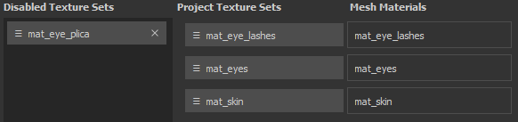

# Reatribuição de conjunto de textura

A janela Reatribuição do conjunto de texturas permite alterar a atribuição da pilha de camadas para uma parte diferente da malha da cena. Isso é útil, por exemplo, quando depois de importar uma nova malha para um projeto existente onde alguns Conjuntos de textura se tornam desativados. Isso acontece porque a pilha de camadas foi atribuída a um Material que não existe mais. Com a janela de reatribuição é possível trazer de volta essa pilha de camadas (consulte “Restauração de conjuntos de texturas desativados” abaixo).

Para acessar a janela de Reatribuição do Conjunto de Texturas, vá para a janela [Lista do Conjunto de Texturas](texture-set-list.md) e escolha **Configurações > Reatribuir Conjuntos de Texturas**.

A janela está dividida em três seções:

* **Conjuntos de Texturas Desabilitados** : lista todos os Conjuntos de Texturas que não estão em uso no momento.
* **Conjuntos de Textura do Projeto** : lista todos os Conjuntos de Textura que estão atualmente atribuídos a um material de Malha.
* **Materiais de malha** : lista os materiais de malha do projeto.

A janela também tem um botão adicional que executa as seguintes ações:

* **Desfazer** : reverter para o estado anterior da janela
* **Refazer**: reaplique uma alteração que foi desfeita.
* **Aplicar**: feche a janela e execute a(s) reatribuição(ões).
* **Cancelar**: feche a janela e descarte quaisquer alterações que estavam em andamento.

## Reatribuindo conjuntos de texturas

A reatribuição de conjuntos de texturas pode ser feita arrastando e soltando os botões.

## Restaurando conjuntos de texturas desativados

Um conjunto de texturas pode ser desativado quando não estiver mais associado a um material de malha.\
Isso pode acontecer ao importar uma nova malha para um projeto onde os nomes do material diferem entre o projeto e a nova malha.

Para restaurar um Conjunto de Texturas, basta **trocar** sua posição por uma na lista “**Conjuntos de Texturas do Projeto**”.

## Excluindo conjuntos de texturas desativados

Clicar na **cruz** ao lado de um Conjunto de Textura na lista **Conjuntos de Textura Desabilitados** **marcará para exclusão**.\
A exclusão acontecerá ao clicar no botão **Aplicar** na parte inferior da janela.

>[!WARNING]
>
> Esta ação não pode ser desfeita depois que a janela é fechada com o botão “Aplicar”.
