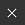

# Configurações do conjunto de texturas

{width="300px"}

As **configurações do Conjunto de Texturas** controlam os parâmetros do Conjunto de Texturas selecionado atualmente. É aqui que a resolução, os canais e os mapas de malha associados podem ser gerenciados.

## Propriedades gerais

| Configuração | Descrição |
| --- | --- |
| **Nome** | Nome do Conjunto de Texturas. Herdado do nome do material atribuído no modelo 3D. |
| **Descrição** | Campo de texto que permite adicionar informações sobre um conjunto de texturas. Este texto é exibido na [lista do Conjunto de Texturas](texture-set-list.md) e nas janelas de [Preparação](../../baking/baking.md). |
| **Tamanho** | Controla a resolução dos canais em pixels dentro de um Conjunto de texturas. Para usar resoluções **não quadradas** (por exemplo, 2048x1024), desabilite o **botão de bloqueio** entre os dois menus suspensos.As resoluções do Conjunto de Texturas são **dinâmicas** devido ao **fluxo de trabalho não destrutivo**. Isso significa que é possível trabalhar em uma resolução baixa para obter boas performances e, em seguida, usar uma resolução mais alta mais tarde para obter uma qualidade melhor. Dentro do aplicativo, a resolução máxima de um canal é de 4096x4096 pixels, ao exportar o máximo é de 8192x8192 (se suportado pela GPU). Alterar a resolução pode desencadear um longo cálculo do motor. |
| **Instância do sombreador** | Defina o [Sombreador](../shader-settings/shader-settings.md) a ser usado para renderizar o Conjunto de Texturas especificado no [visor](../viewport/viewport.md). |

## Canais

### Lista de canais

A lista pode ser modificada a qualquer momento adicionando ou removendo canais (a menos que seja substituída pelo fluxo de trabalho [Camada de material](../../features/dynamic-material-layering.md)).

| Botão / Ícone | Descrição |
| --- | --- |
| <b>Adicionar canal</b>  

 | Clique neste botão para adicionar um novo canal à lista.O menu pop-up que é aberto é dividido em três categorias:<ul data-preserve-html="true"><li data-preserve-html="true"><strong>Canais com suporte</strong>: esses canais podem ser usados pelo sombreador atual no visor.</li><li data-preserve-html="true"><strong>Canais sem suporte</strong>: esses canais são ignorados pelo sombreador atual no visor.</li><li data-preserve-html="true"><strong>Canais de usuário</strong>: canais adicionais para pintar mais informações, geralmente não suportados pelos sombreadores.</li></ul>  **Observação:** não há limite em quantos canais podem ser adicionados, no entanto, muitos canais podem afetar gravemente o desempenho e exigirão mais memória. |
| <b>Remover canal</b>  

 | Remove um canal da lista.  **Observação:** as informações de pintura dentro do projeto não são excluídas com o canal, portanto, o canal pode ser adicionado novamente mais tarde, se necessário, para recuperar a texturização (após um recálculo). |
| <b>Nome do canal</b>  

 | O nome de um canal fornecido.Os canais do usuário podem ser renomeados clicando duas vezes no nome atual: 

 |
| <b>Configurações de canal</b>  

 | Este botão abre o menu de configurações do canal com várias ações.A primeira lista de ações controla o tipo de armazenamento e a precisão do canal:<ul data-preserve-html="true"><li data-preserve-html="true"><strong>sRGB8</strong>: cores RGB, valores corrigidos de gama, armazenados em 8 bits.</li><li data-preserve-html="true"><strong>L8</strong>: valores de tons de cinza, armazenados em 8 bits.</li><li data-preserve-html="true"><strong>RGB8</strong>: cores de RGB, armazenadas em 8 bits.</li><li data-preserve-html="true"><strong>L16</strong>: valores em tons de cinza, armazenados em 16 bits.</li><li data-preserve-html="true"><strong>RGB16</strong>: cores de RGB, armazenadas em 16 bits.</li><li data-preserve-html="true"><strong>L16F</strong>: valores em tons de cinza - positivos e negativos, armazenados em 16 bits flutuantes.</li><li data-preserve-html="true"><strong>RGB16F</strong>: cores RGB - positivas e negativas, armazenadas em flutuação de 16 bits.</li><li data-preserve-html="true"><strong>L32F</strong>: valores em tons de cinza - positivos e negativos, armazenados em 32 bits flutuantes.</li><li data-preserve-html="true"><strong>RGB32F</strong>: cores RGB - positivas e negativas, armazenadas em flutuação de 32 bits.</li></ul>  **Observação:** o tipo de armazenamento **não é um controle de espaço de cores/gama.** Os dados usados para armazenar as informações de um canal (por exemplo, sRGB8 ou L32F) não têm efeito sobre a maneira como o aplicativo as lerá. Por exemplo, o canal de Aspereza ainda será considerado como dados/raw, e a Cor base ainda será considerada corrigida para a gama.  A última ação do menu pode ser usada para habilitar ou desabilitar o [gerenciamento de cores](../../features/color-management/color-management.md) no canal:<ul data-preserve-html="true"><li data-preserve-html="true"><strong>Canal de cores</strong>: se habilitado, o canal é gerenciado por cores. Essa opção só pode ser modificada manualmente para canais do usuário.</li></ul> |
| <b>Cor gerenciada</b>  

 | Se presente, indica que o canal tem gerenciamento de cores. Somente os canais do usuário podem ser marcados como gerenciados por cores ou não; o comportamento dos outros canais é corrigido.Para obter uma lista detalhada de quais canais são gerenciados por cores ou não, consulte: [Gerenciamento de cores](../../features/color-management/color-management.md). |

### Configurações de mixagem

Essas configurações controlam vários comportamentos em como os canais são gerados, notavelmente como os canais são combinados com as texturas assadas (mapas de malha).

| Configuração | Descrição |
| --- | --- |
| **Mistura normal** | Controla como o “mapa normal cozido” deve ser combinado com o canal “Normal”. Os valores possíveis são:<ul data-preserve-html="true"><li data-preserve-html="true"><strong> Substituir </strong>: Ignorar o “mapa normal preparado” e usar somente o canal “Normal” para este Conjunto de Texturas. Pode ser usado para pintar sobre um mapa normal cozido. Consulte a documentação da [pintura de canal avançada](../../painting/advanced-channel-painting/normal-map-painting.md)para obter mais informações. se o canal Normal não estiver presente ou se a saída do canal Normal estiver vazia, o mapa normal cozido ainda será usado.</li><li data-preserve-html="true"><strong> Combinar </strong> (padrão): use uma função orientada a detalhes para combinar o canal “Normal” e o “mapa normal cozido”.</li></ul>  **Observação:** esta configuração poderá ser desabilitada se o canal estiver ausente na lista de canais. Se o canal estiver ausente, o valor de mixagem padrão será usado. |
| **Height para o método normal** | Controla o método a ser usado para converter o canal de height em um mapa normal. Os valores possíveis são:<ul data-preserve-html="true"><li data-preserve-html="true"><strong>Nítido</strong>: produz um mapa normal mais definido com o risco de introduzir ruído e suavização. Adaptado para padrões repetidos, como tecidos.</li><li data-preserve-html="true"><strong>Suavizar (Sobel)</strong> (padrão): produza um mapa normal mais suave com um filtro Sobel, sob o risco de perder detalhes. Adaptado para a maioria dos casos.</li></ul> |
| **Mistura de oclusão ambiente** | Controla como a “oclusão ambiente cozida” deve ser combinada com o canal “Oclusão ambiente”. Os valores possíveis são:<ul data-preserve-html="true"><li data-preserve-html="true"><strong> Substituir </strong>: Ignorar a “oclusão ambiente cozida” e usar apenas o canal “Oclusão ambiente” para este Conjunto de Textura. Pode ser usado para pintar sobre uma oclusão ambiente assada. Consulte a documentação da [pintura de canal avançada](../../painting/advanced-channel-painting/ambient-occlusion-painting.md) para obter mais informações.  </li><li data-preserve-html="true"><strong> Multiplicação </strong> (padrão): use uma operação de multiplicação para combinar o canal “Oclusão ambiente” e a “oclusão ambiente cozida”.  </li></ul>  **Observação:** esta configuração poderá ser desabilitada se o canal estiver ausente na lista de canais. Se o canal estiver ausente, o valor de mixagem padrão será usado. |
| **Preenchimento UV** | Controla como o preenchimento fora da Ilha UV é gerado. Os valores possíveis são:  <ul class="steps" data-preserve-html="true"> <li class="step" data-preserve-html="true">    <strong>Vizinho do Espaço 3D</strong> (padrão): observe o outro lado da linha UV para encontrar a cor do pixel vizinho e use-a na borda UV. Essa configuração é recomendada ao pintar em emendas UV com padrões contínuos. Exemplo com preenchimento regular à esquerda e o Vizinho 3D à direita:           </li> <li class="step" data-preserve-html="true">    <strong>Vizinho de Espaço 2D</strong>: copie o pixel dentro de uma Ilha UV para a borda fora da Ilha UV antes de gerar o preenchimento. Essa configuração é recomendada quando as Ilhas UV têm informações muito opostas e não se sobrepõem. Exemplo com uma esfera em que as bandas têm cada uma uma cor exclusiva por Ilha UV, à esquerda com a configuração de vizinho 2D e à direita com um vizinho 3D (observe o sangramento):           </li> </ul>  **Observação:** esta configuração de preenchimento é salva por conjunto de textura e levada em consideração durante a exportação e visualização de textura no visor.Por causa de como o vizinho de espaço 3D funciona, ele não pode ser usado com o canal normal e usará a versão 2D. |

## Mapas de malha

Os mapas de malha são texturas assadas específicas para a malha e o conjunto de texturas usados para aumentar a qualidade da texturização com a ajuda de filtros, materiais inteligentes e máscaras inteligentes. Para obter mais detalhes, consulte a documentação do [cozimento](../../baking/baking.md).
