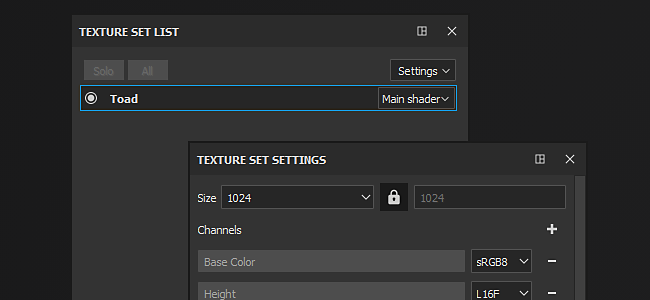

# Conjunto de texturas

O Substance 3D Painter criará automaticamente um novo Conjunto de Texturas cada vez que encontrar uma ID de material em uma malha importada ([a menos que um projeto use o fluxo de trabalho de Bloco UV](../../features/uv-tiles/uv-tiles.md)).

Espera-se que cada ID de material tenha UVs exclusivos (ou sobreposição lógica para geometria espelhada).

Para obter mais detalhes sobre as propriedades e manipulações do **Conjunto de Texturas**, consulte:

* [Lista do conjunto de texturas](texture-set-list.md)
* [Configurações do conjunto de texturas](texture-set-settings.md)
* [Reatribuição de conjunto de textura](texture-set-reassignment.md)
