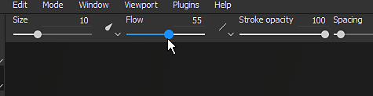

# Barras de ferramentas

Esta página fornece uma visão geral rápida de toda a barra de ferramentas disponível. Cada um deles contendo diferentes ações e configurações.

Abaixo está uma lista de todas as barras de ferramentas disponíveis.

## Ferramentas

{width="450px"}

A **barra de ferramentas Ferramentas** está disponível por padrão no canto superior esquerdo da interface principal. Ela lista todas as [ferramentas de pintura](../painting/painting.md) que podem ser usadas para texturizar a malha 3D do projeto aberto no momento. Essas ferramentas só são acessíveis quando uma camada de pintura está selecionada.

Algumas ferramentas têm um segundo modo chamado “Físico”, que permite a pintura de partículas. A pintura de partículas também pode ser acessada clicando nas predefinições Pincel de partículas na janela [Ativos](assets/assets.md).

Esta barra de ferramentas só pode ser encaixada verticalmente no lado esquerdo ou direito da interface principal.

## Docas

{width="450px"}

A <b>Barra de Ferramentas de Encaixe</b> está disponível por padrão na parte superior direita da interface principal. Sua finalidade é oferecer um acesso rápido às janelas da doca para abri-las e fechá-las rapidamente.

Clicar em um dos botões na barra de ferramentas exibirá o Dock próximo ao seu botão e flutuando acima do resto da interface, clicando novamente no botão irá fechá-lo. Se o encaixe se afastar de seu botão, ele se torna uma janela flutuante regular que pode ser encaixada na interface. Se fechado, o botão estará disponível novamente na barra de ferramentas do Dock.

{width="450px"}

Esta barra de ferramentas só pode ser encaixada verticalmente no lado esquerdo ou direito da interface principal.

## Plug-ins

{width="450px"}

A **Barra de ferramentas de plug-ins** lista os plug-ins de script instalados (e atualmente habilitados) do Substance 3D Painter. Para saber mais sobre plug-ins e seu uso, consulte [Plug-ins](../features/plugins/plugins.md).

## Contextual

{width="450px"}

A Barra de ferramentas contextual é uma barra de ferramentas em que partes de seu conteúdo são alteradas, dependendo da ferramenta atual selecionada ou de outra propriedade que esteja sendo modificada. O lado esquerdo da barra de ferramentas pode ser alterado, mas o lado direito é fixo e lista atalhos para modificar a exibição do [Viewport](viewport/viewport.md).

Essa barra de ferramentas pode listar propriedades para os seguintes elementos:

* [Pintura](../painting/painting.md)
* [Manipuladores para projeções de camada de preenchimento](../painting/fill-projections/fill-projections.md)

Esta barra de ferramentas não pode ser movida e sempre fica na parte superior das viewports.
