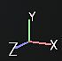

# Visualização 3D

{width="370px"}

A Visualização 3D mostra o modelo 3D em condições de iluminação, o que ajuda a ver como o material da superfície é definido. É também aqui que é possível pintar diretamente sobre o modelo 3D.

## Perfil

No canto superior esquerdo da viewport poderá aparecer um texto indicando o perfil carregado atualmente. Para obter mais informações, consulte a página [Perfil de Cores](../../features/post-processing/color-profile.md).

## Seleção de câmera

Se o arquivo de modelo 3D usado para criar o projeto ou importar a malha tiver câmeras definidas, elas poderão ser importadas para o projeto e usadas para alterar o local e a orientação da câmera. Este menu suspenso permite alternar entre as câmeras disponíveis no projeto. Se não houver outra câmera além da padrão, o menu suspenso não será exibido.

É possível alternar rapidamente entre câmeras usando o [atalho de teclado](../settings/shortcuts.md) dedicado. Para obter mais informações, consulte a página [Gerenciamento de câmera](camera-management.md).

## Modo de exibição

Por padrão, o modo de exibição do visor é definido como material para mostrar a iluminação do ambiente. O menu suspenso permite alternar o modo de exibição para solo, o que isola canais e mapas de malha individualmente.

Essa iluminação pode ser controlada por meio das [Configurações de exibição](../display-settings/display-settings.md), bem como de outras configurações de renderização. A orientação da iluminação também pode ser alterada com a ajuda do [atalho de teclado](../settings/shortcuts.md).

## Eixo

Na parte inferior direita da viewport está o eixo de visualização 3D, que indica como a cena é orientada em comparação com a câmera.

## Configurações adicionais

A exibição do visor pode ser afetada por outras configurações:

* [Configurações do sombreamento](../shader-settings/shader-settings.md)
* [Pós-processamento](../../features/post-processing/post-processing.md)
