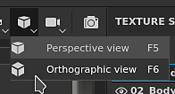

# Janela de visualização

{width="600px"}

A viewport é o local onde a malha 3D e suas texturas são exibidas. É também aqui que é possível pintar na superfície de malha 3D.

## Visão geral

A viewport é dividida em quatro partes:

* **Barra de ferramentas contextual**: esta barra de ferramentas fica na parte superior da viewport e oferece atalho para várias propriedades, dependendo do contexto atual (parâmetros de pincel ao pintar, por exemplo).
* **Exibição 3D**: esta exibição mostra a malha 3D de um ângulo específico, definido por uma câmera.
* **Exibição 2D**: esta exibição mostra o desencapsulamento UV da malha 3D do [Conjunto de Texturas](../texture-set/texture-set-list.md) atualmente selecionado.
* **Barra de progresso**: esta barra cinza/verde na parte inferior do visor aparece quando um cálculo está em andamento (por exemplo, quando o mecanismo está gerando texturas).

Para obter mais detalhes, consulte as páginas dedicadas:

* [Exibição 2D](2d-view.md)
* [Visualização 3D](3d-view.md)
* [Gerenciamento de câmera](camera-management.md)

As exibições 3D e 2D podem ser ajustadas para exibir informações adicionais ou diferentes por meio das [Configurações de exibição](../../interface/display-settings/display-settings.md).

## Controles de navegação do visor

Os controles de movimentação na viewport são semelhantes em ambas as exibições 2D e 3D.

<table>
  <tr>
    <th>Tipo de movimento</th>
    <th>Atalho</th>
    <th>Descrição</th>
  </tr>
  <tr>
    <td>Órbita/rotação </td>
    <td><strong>Alt + clique com o botão esquerdo</strong></td>
    <td><ul><li>Visualização 3D: orbite a câmera em torno da posição do cursor.</li><li>Visualização 2D: gire o espaço UV ao redor da posição do cursor.</li></ul></td>
  </tr>
  <tr>
    <td>Panorâmica</td>
    <td><strong>Alt + clique no meio</strong></td>
    <td>Mova a câmera para cima, para baixo, para a esquerda ou para a direita.</td>
  </tr>
  <tr>
    <td>Zoom/plataforma</td>
    <td><strong>Alt + clique com o botão direito do mouse</strong></td>
    <td>Aplique zoom mais próximo ou mais distante da malha/UVs.</td>
  </tr>
</table>

>[!NOTE]
> Em exibições 2D e 3D, você pode ajustar a ângulos ortogonais ao orbitar/girar com **Alt + Shift + clique com o botão esquerdo**.

## Alterar O Layout

O layout padrão coloca a exibição 3D à esquerda e a exibição 2D à direita. Alguns parâmetros estão disponíveis na **Barra de Ferramentas Contextual** que permitem alterar o layout:

<table>
  <tr>
    <th><em>Configuração</em></th>
    <th><em>Descrição</em></th>
  </tr>
  <tr>
    <td><strong>Modo Viewport</strong> </td>
    <td>Estas configurações controlam o layout do visor: <ul><li><strong>3D/2D</strong> (padrão): exibe as exibições 3D e 2D no visor</li><li><strong>Somente 3D</strong>: maximize a exibição 3D e oculte a exibição 2D.</li><li><strong>Somente 2D</strong>: maximize a exibição 2D e oculte a exibição 3D.</li><li><strong>Trocar 3D/2D</strong>: troque a ordem na qual as exibições são exibidas. Se a visualização 3D estiver à esquerda, ela ficará à direita após a escolha desta ação.</li></ul></td>
  </tr>
  <tr>
    <td><strong>Modo de perspectiva</strong> </td>
    <td>Estas configurações controlam como a malha 3D será exibida na visualização 3D: <ul><li><strong>Exibição de perspectiva</strong> (padrão): exibe a malha 3D como ela seria vista pelo olho humano ou por uma câmera.</li><li><strong>Exibição ortográfica</strong>: exibe a malha 3D como todas as direções que medem o mesmo comprimento.</li></ul></td>
  </tr>
  <tr>
    <td><strong>Modo de rotação da câmera</strong> </td>
    <td>Estas configurações controlam em quantos eixos a câmera do visor pode girar. <ul><li><strong>Rotação livre</strong>: a câmera gira nos eixos X, Y e Z.</li><li><strong>Rotação restrita</strong> (padrão): a câmera gira apenas nos eixos X e Y (sem rolagem).</li></ul></td>
  </tr>
  <tr>
    <td><strong>Modo de renderização</strong> </td>
    <td>Alterne para o <a href="../../features/iray-renderer/iray-renderer.md">modo de renderização</a>.</td>
  </tr>
</table>
